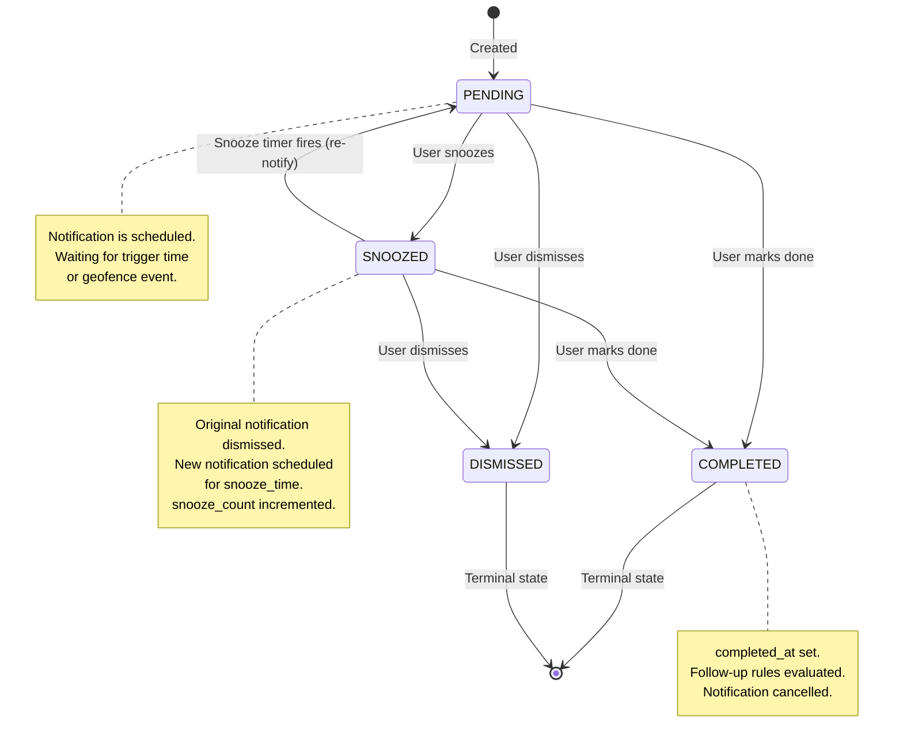
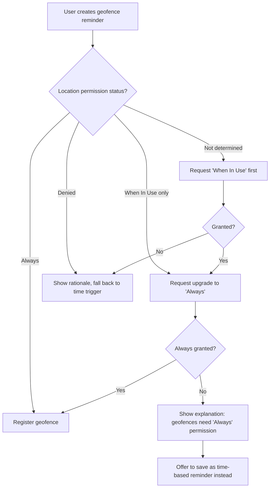
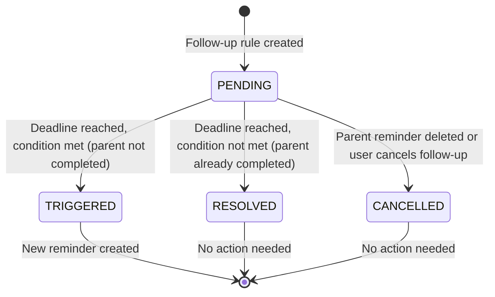
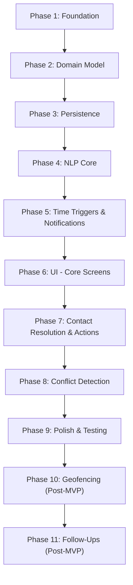

# KATALA — Complete Product & Technical Specification

**Version:** 1.0.0-draft
**Date:** 2026-08-10
**Status:** Implementation-Ready Specification
**Source:** PLAN.md (vision document)

---

> **Purpose of this document:** This specification answers the question: "If I gave this document to a highly capable coding agent with an empty repository, could it build Katala without inventing major product behavior or architecture?" The answer must be **yes**.

---

## Table of Contents

1. [Product Definition](#1-product-definition)
2. [Goals & Non-Goals](#2-goals--non-goals)
3. [User Journeys](#3-user-journeys)
4. [Functional Requirements](#4-functional-requirements)
5. [NLP Architecture](#5-nlp-architecture)
6. [Reminder Domain Model](#6-reminder-domain-model)
7. [Data Model](#7-data-model)
8. [Notification Architecture](#8-notification-architecture)
9. [Action System](#9-action-system)
10. [Geofencing](#10-geofencing)
11. [Follow-Up Engine](#11-follow-up-engine)
12. [UX Specification](#12-ux-specification)
13. [Accessibility](#13-accessibility)
14. [Privacy & Security](#14-privacy--security)
15. [Offline Behavior](#15-offline-behavior)
16. [Platform Architecture](#16-platform-architecture)
17. [Database Decision](#17-database-decision)
18. [Testing Strategy](#18-testing-strategy)
19. [Acceptance Criteria](#19-acceptance-criteria)
20. [MVP Scope](#20-mvp-scope)
21. [Post-MVP Scope](#21-post-mvp-scope)
22. [Architectural Decisions](#22-architectural-decisions)
23. [Implementation Roadmap](#23-implementation-roadmap)
24. [Coding-Agent Constraints](#24-coding-agent-constraints)
25. [Open Questions](#25-open-questions)

---

## 1. Product Definition

### 1.1 What Is Katala?

Katala is an **offline-first, voice-driven, context-aware smart reminder application** for iOS and Android. Named after the Philippine Red-vented Cockatoo (*Cacatua haematuropygia*), known for its intelligence and distinctive voice, Katala converts natural speech into actionable, context-rich reminders entirely on-device.

### 1.2 Core Identity

- **Offline-first:** All core functionality works without an internet connection. No cloud APIs, no user accounts, no server costs.
- **Voice-driven:** The primary input mechanism is spoken natural language. Text input is the secondary fallback.
- **Context-aware:** Reminders carry actionable payloads — phone calls, URLs, directions — not just text labels.
- **Privacy-guaranteed:** All data processing occurs on-device. No user data is transmitted to any server under any circumstance during normal operation.

### 1.3 User Types

**Primary User Persona: The Busy Professional**
- Age 25–55
- Uses a smartphone as their primary productivity tool
- Frequently needs reminders for calls, meetings, tasks
- May be driving, commuting, or in situations where typing is impractical
- Values speed over polish — wants to capture a reminder in under 5 seconds
- May speak English, Filipino, or Taglish (mixed Filipino-English)
- May have limited or intermittent internet connectivity

**Secondary User Persona: The Privacy-Conscious User**
- Specifically avoids cloud-based assistants (Siri, Google Assistant)
- Chooses Katala because of its provable on-device architecture
- Willing to accept slightly reduced functionality in exchange for guaranteed privacy

**Assumptions About Users:**
- Users have a modern smartphone (iOS 16+ or Android 10+)
- Users have basic familiarity with voice assistants or voice typing
- Users may have contacts stored in their phone's address book
- Users understand the concept of reminders and notifications
- Users may not understand technical concepts like "geofencing" but will understand "remind me when I get to the office"
- Users may speak imperfect English, use slang, or mix languages

### 1.4 What Katala Is NOT

- Katala is **not a calendar app**. It does not manage events, invitations, or multi-party scheduling.
- Katala is **not a voice assistant**. It does not answer questions, control smart home devices, or make purchases.
- Katala is **not a task manager**. It does not support projects, subtasks, priorities, tags, or Kanban boards.
- Katala is **not a communication app**. It facilitates initiating calls/texts but does not handle them.
- Katala is **not a note-taking app**. Voice input creates reminders, not freeform notes.

---

## 2. Goals & Non-Goals

### 2.1 Goals

| ID | Goal | Measurable Criterion |
|----|------|---------------------|
| G1 | Voice-to-reminder in under 5 seconds for simple commands | From mic tap to persisted reminder < 5s on mid-range devices |
| G2 | 100% offline core functionality | All features in MVP Scope work with airplane mode enabled |
| G3 | Zero data transmission to external servers | No network requests made during normal operation |
| G4 | Actionable notifications with 1-tap actions | Notification banners include contextual action buttons |
| G5 | Schedule conflict awareness | New reminders at times with existing reminders trigger a conflict warning |
| G6 | Location-based triggers | Reminders can fire when entering/exiting a geographic area |
| G7 | Follow-up chaining | Users can create conditional follow-up reminders from completed/snoozed reminders |
| G8 | Natural language understanding | Parser handles relative times, contacts, actions, and locations |
| G9 | Cross-platform | Single codebase serving iOS and Android |
| G10 | Accessible | Meets WCAG 2.1 AA equivalent for mobile |

### 2.2 Non-Goals

| ID | Non-Goal | Rationale |
|----|----------|-----------|
| NG1 | Cloud sync between devices | Contradicts offline-first privacy model |
| NG2 | User accounts or authentication | No server, no accounts |
| NG3 | Calendar integration | Out of scope; adds complexity without core value |
| NG4 | Multi-party reminders / sharing | Requires server infrastructure |
| NG5 | Voice wake word ("Hey Katala") | Requires always-on microphone; battery and privacy concerns |
| NG6 | Smart home control | Not a voice assistant |
| NG7 | Web or desktop version | Mobile-only for MVP |
| NG8 | AI/LLM-powered conversation | Must work offline with deterministic rule-based parsing |
| NG9 | Recurring reminder editing via voice | Too complex for rule-based NLP; UI-only for MVP |
| NG10 | Custom notification sounds per reminder | OS limitations make this unreliable; use category-level sounds |

---

## 3. User Journeys

### 3.1 Journey: Creating a Simple Reminder by Voice

**Trigger:** User opens app and speaks "Remind me to buy groceries tomorrow at 5 PM"

| Step | User Action | System Response | UI State | Data Changes | Notification | Failure | Recovery |
|------|------------|-----------------|----------|-------------|--------------|---------|----------|
| 1 | Opens app | App launches to home screen. Microphone button is prominent. | Home screen with timeline | None | None | App crashes → OS restart | Re-open app |
| 2 | Taps microphone button | Audio session activates. Listening animation begins. Haptic feedback (single tap). | Listening state: pulsing mic icon, waveform animation | None | None | Mic permission denied → show permission rationale | Display "Microphone access needed" with button to Settings |
| 3 | Speaks: "Remind me to buy groceries tomorrow at 5 PM" | Speech-to-text converts audio to text. Transcript appears in real-time. | Transcribing state: live text appearing | None | None | STT fails (no model) → show error | Fall back to text input with message "Voice unavailable — type your reminder" |
| 4 | Stops speaking (auto-detected silence or taps stop) | NLP pipeline processes transcript. Intent: CREATE_REMINDER. Extracts: title="buy groceries", time="tomorrow 5:00 PM (resolved to absolute datetime)". Confidence: HIGH (>0.85). | Processing state: brief spinner (< 500ms) | None | None | Parse fails → show raw transcript with manual edit | Show transcript with "I couldn't understand that — edit below" |
| 5 | System shows confirmation card | Displays: "Buy groceries — Tomorrow at 5:00 PM" with [Save] and [Edit] buttons. | Confirmation state | None | None | N/A | N/A |
| 6 | Taps [Save] (or auto-saves at HIGH confidence after 2s) | Reminder persisted to database. Notification scheduled with OS. Haptic feedback (success). Brief bird chirp sound. | Success state → returns to home timeline showing new reminder | Reminder inserted (PENDING). Notification registered with OS. | Notification scheduled for tomorrow 5:00 PM local time. | DB write fails → retry once, then show error | Show "Couldn't save — try again" with retry button |
| 7 | N/A — next day at 5:00 PM | Notification fires. | N/A (app may be closed) | Reminder status remains PENDING until user acts | Banner: "Buy groceries" with actions: [✓ Done] [⏰ Snooze] | Notification permission denied → reminder exists but user won't see it | On next app open, show overdue reminders prominently |

### 3.2 Journey: Creating a Reminder by Text/Manual Input

**Trigger:** User prefers typing or voice is unavailable.

| Step | User Action | System Response | UI State | Data Changes | Notification | Failure | Recovery |
|------|------------|-----------------|----------|-------------|--------------|---------|----------|
| 1 | Taps "+" button or swipes from mic to keyboard icon | Text input field appears with cursor focused. Keyboard opens. | Manual creation form | None | None | N/A | N/A |
| 2 | Types: "Call dentist Monday 9am" | Real-time NLP parses as user types (debounced at 300ms after last keystroke). Shows parsed preview below input. | Form with parsed preview: Title="Call dentist", Time="Monday 9:00 AM", Type=CALL | None | None | Parse incomplete → show what was understood, highlight unknowns | User can manually set fields |
| 3 | Reviews parsed fields. Optionally edits title, time, or type using form controls. | Form fields update. Date picker and time picker available. | Editable form with pre-filled fields | None | None | N/A | N/A |
| 4 | Taps [Save] | Reminder persisted. Notification scheduled. | Success → home timeline | Reminder inserted (PENDING) | Scheduled notification | DB error → retry | Error message + retry |

### 3.3 Journey: Creating a Call Reminder

**Trigger:** User speaks "Remind me to call Adam at 2 PM"

| Step | User Action | System Response | UI State | Data Changes | Notification | Failure | Recovery |
|------|------------|-----------------|----------|-------------|--------------|---------|----------|
| 1-4 | (Same as 3.1 steps 1-4) | NLP extracts: intent=CREATE_REMINDER, title="Call Adam", action=CALL, contact="Adam", time="2:00 PM today". | Processing | None | None | — | — |
| 5 | System resolves contact | Searches device contacts for "Adam". If exactly 1 match: attaches phone number. If multiple matches: shows disambiguation. If no match: stores name only, no number. | Confirmation card shows: "Call Adam — 2:00 PM" with resolved phone number or "(no phone number found)" | None | None | Contacts permission denied → store name only | Show "To add a phone number, grant contacts access" |
| 6 | Taps [Save] | Reminder saved with action=CALL and target_entity=phone_number (if resolved). | Success | Reminder inserted with intent_type=CALL | At 2:00 PM: "Call Adam" with actions: [📞 Call Now] [⏰ Snooze 10m] [✓ Done] | — | — |
| 7 | Notification fires at 2 PM. User taps [📞 Call Now] | System opens phone dialer with Adam's number pre-filled. Reminder marked COMPLETED. | Phone app opens | Reminder status → COMPLETED, completed_at set | Notification dismissed | No phone number → show error in-app: "No number for Adam" | Open reminder detail where user can add number manually |

### 3.4 Journey: Creating a URL Reminder

**Trigger:** User speaks "Remind me to check this link at 8 PM — https://example.com/report"

| Step | User Action | System Response | UI State | Data Changes | Notification | Failure | Recovery |
|------|------------|-----------------|----------|-------------|--------------|---------|----------|
| 1-4 | Same as 3.1 | Extracts: title="check this link", action=OPEN_URL, target="https://example.com/report", time="8:00 PM today" | Processing | None | None | URL detection fails → stored as plain text reminder | User can manually paste URL in edit |
| 5 | Confirmation shown | "Check this link — 8:00 PM" with URL preview | Confirmation | None | None | — | — |
| 6 | Saves | Reminder persisted | Success | Reminder with intent_type=LINK | At 8 PM: "Check this link" with [🔗 Open Link] [✓ Done] | — | — |
| 7 | User taps [🔗 Open Link] | Opens URL in default browser. Reminder marked COMPLETED. | Browser opens | Status → COMPLETED | Notification dismissed | URL invalid or no browser → show error | Show reminder detail with URL for manual copy |

### 3.5 Journey: Creating a Location Reminder

**Trigger:** User speaks "Remind me to buy milk when I get to the grocery store"

| Step | User Action | System Response | UI State | Data Changes | Notification | Failure | Recovery |
|------|------------|-----------------|----------|-------------|--------------|---------|----------|
| 1-4 | Same as 3.1 | Extracts: title="buy milk", trigger_type=GEOFENCE, location_phrase="grocery store" | Processing | None | None | — | — |
| 5 | System needs to resolve location | "grocery store" is not a saved location. Shows: "Where is 'grocery store'?" with options: [Search on Map] [Use Current Location] [Choose Saved Location] | Location resolution screen | None | None | Location permission denied → show rationale | "Location access needed for location reminders" with Settings button |
| 6 | User searches and pins location on map | Map view with search bar. User types "SM Supermarket" or browses. Taps to set pin. Radius shown as circle (default 200m). | Map with geofence preview | None | None | No map tiles (offline) → show coordinate input or saved locations only | Degrade to saved locations picker |
| 7 | User confirms location and optionally saves it ("Save as 'Grocery Store'") | Location stored. Geofence registered with OS. Reminder saved. | Success | Reminder with trigger_type=GEOFENCE, location saved if user chose to save | When user enters geofence: "Buy milk" with [✓ Done] [⏰ Snooze] | — | — |

> **Platform constraint:** iOS limits apps to 20 monitored geofence regions. Android limits to 100. The app must track active geofences and warn users when approaching limits.

### 3.6 Journey: Creating a Geofence Reminder (Saved Location)

**Trigger:** User speaks "Remind me to grab my jacket when I leave the office"

| Step | User Action | System Response | UI State | Data Changes | Notification | Failure | Recovery |
|------|------------|-----------------|----------|-------------|--------------|---------|----------|
| 1-4 | Same as 3.1 | Extracts: title="grab my jacket", trigger_type=GEOFENCE, location="office", direction=EXIT | Processing | None | None | — | — |
| 5 | System resolves "office" | If "Office" exists in saved locations: auto-resolves. If not: prompts for location (same as 3.5 step 5-6). | Confirmation: "Grab my jacket — When leaving Office" | None | None | — | — |
| 6 | Saves | Geofence registered for EXIT event. | Success | Reminder with trigger_type=GEOFENCE, geofence_direction=EXIT | When user exits geofence: notification fires | Geofence limit reached → "You've reached the maximum location reminders. Complete or delete one first." | Show list of active geofence reminders for management |

### 3.7 Journey: Receiving a Reminder

**Trigger:** A scheduled reminder's trigger time arrives, or a geofence boundary is crossed.

| Step | System Action | UI State | Data Changes | Notification | Failure | Recovery |
|------|--------------|----------|-------------|--------------|---------|----------|
| 1 | OS fires notification at scheduled time or geofence event | App may be in foreground, background, or terminated | None yet | Notification displayed as banner/alert | Notification failed to fire (notification permission revoked) → no recovery possible at trigger time | On next app open: show overdue reminders |
| 2 | Notification displayed | Lock screen / notification shade / banner | None | Banner: "[Reminder Title]" Body: "[Notes if any]" Actions: context-dependent (see §9) | — | — |
| 3 | If app is in foreground: show in-app alert | Modal overlay with reminder details and action buttons | None | In-app notification card | — | — |

### 3.8 Journey: Acting on a Notification

See §9 (Action System) for full action specifications. Summary:

| Reminder Type | Action 1 | Action 2 | Action 3 |
|--------------|----------|----------|----------|
| GENERAL | ✓ Done | ⏰ Snooze | — |
| CALL | 📞 Call Now | ⏰ Snooze | ✓ Done |
| LINK | 🔗 Open Link | ⏰ Snooze | ✓ Done |
| LOCATION | 🗺️ Directions | ⏰ Snooze | ✓ Done |

**When user taps an action:**
- **Done:** Reminder status → COMPLETED. Notification dismissed. If follow-up rules exist, evaluate them (see §11).
- **Snooze:** Reminder status → SNOOZED. New notification scheduled for snooze_time (default: +10 minutes). User can customize snooze duration in settings (5m, 10m, 15m, 30m, 1h).
- **Call Now / Open Link / Directions:** Execute external action. Reminder status → COMPLETED. Notification dismissed.

### 3.9 Journey: Snoozing a Reminder

| Step | User Action | System Response | UI State | Data Changes | Notification | Failure | Recovery |
|------|------------|-----------------|----------|-------------|--------------|---------|----------|
| 1 | Taps [⏰ Snooze] on notification | Notification dismissed. New notification scheduled. | Notification disappears | Reminder status → SNOOZED. snooze_count incremented. New trigger_time = now + snooze_duration. | New notification at snooze_time | Failed to schedule → show on next app open | Show overdue reminder |
| 2 | (Alternative) Opens reminder detail and taps Snooze with custom time | Picker shows: 5m, 10m, 15m, 30m, 1h, Custom | Snooze picker | Same as above with custom duration | Notification at selected time | — | — |

**Maximum snooze limit:** 10 consecutive snoozes per reminder. After 10, the snooze option disappears and the reminder shows "Snoozed too many times — mark as done or delete." This prevents infinite snooze loops.

### 3.10 Journey: Completing a Reminder

| Step | User Action | System Response | UI State | Data Changes | Notification | Failure | Recovery |
|------|------------|-----------------|----------|-------------|--------------|---------|----------|
| 1 | Taps [✓ Done] on notification OR swipes reminder in timeline | Haptic feedback (success). Brief confirmation animation. | Reminder moves to "Completed" section or disappears from active timeline | Status → COMPLETED. completed_at = now. Pending notification cancelled. | Notification dismissed | — | — |
| 2 | If follow-up rules exist | Follow-up engine evaluates conditions (see §11) | May show follow-up prompt | Follow-up reminder may be created | Follow-up notification may be scheduled | — | — |

### 3.11 Journey: Editing a Reminder

| Step | User Action | System Response | UI State | Data Changes | Notification | Failure | Recovery |
|------|------------|-----------------|----------|-------------|--------------|---------|----------|
| 1 | Taps reminder in timeline | Opens reminder detail view | Detail view: all fields visible | None | None | — | — |
| 2 | Taps [Edit] or taps editable field | Fields become editable. Can change: title, notes, time, date, type, contact, URL, location | Edit mode | None until save | None | — | — |
| 3 | Modifies fields (e.g., changes time) | If time changed: conflict detection runs. If conflict found: warning shown (see §7). | Edit mode with optional conflict warning | None until save | None | — | — |
| 4 | Taps [Save] | Reminder updated. Previous notification cancelled. New notification scheduled if time changed. | Returns to detail view or timeline | Reminder updated. updated_at = now. | Old notification cancelled, new one scheduled | DB error → retry | Error + retry |

### 3.12 Journey: Deleting a Reminder

| Step | User Action | System Response | UI State | Data Changes | Notification | Failure | Recovery |
|------|------------|-----------------|----------|-------------|--------------|---------|----------|
| 1 | Swipes left on reminder in timeline, or taps [Delete] in detail view | Confirmation dialog: "Delete this reminder?" [Delete] [Cancel] | Confirmation dialog | None | None | — | — |
| 2 | Confirms deletion | Reminder deleted. Notification cancelled. Geofence unregistered if applicable. Follow-up rules deleted. Haptic feedback. | Reminder removed from timeline | Reminder soft-deleted (is_deleted=true, deleted_at=now). Notification cancelled. Geofence removed. Child reminders cascade-deleted. | Pending notification cancelled | DB error → retry | Error + retry |

> **Design decision:** Soft-delete with 30-day retention. Hard delete after 30 days via background cleanup. This allows "undo" within the session (5-second undo toast) and potential future "recently deleted" view.

### 3.13 Journey: Handling an Ambiguous Voice Command

**Trigger:** User speaks "Remind me about John tomorrow"

| Step | User Action | System Response | UI State | Data Changes | Notification | Failure | Recovery |
|------|------------|-----------------|----------|-------------|--------------|---------|----------|
| 1-3 | Same as 3.1 | NLP parses. Extracts: title="about John" (ambiguous — is this a call? a meeting?), time="tomorrow" (no specific time). Confidence: MEDIUM (0.5-0.85). | Processing | None | None | — | — |
| 4 | System asks clarification | Shows: "Remind you about John — when tomorrow?" with suggestions: [9:00 AM] [12:00 PM] [5:00 PM] [Pick a time] | Clarification card | None | None | — | — |
| 5 | User selects time | Reminder saved with selected time. Since no action type detected, saved as GENERAL. | Success | Reminder inserted as GENERAL type | Notification scheduled | — | — |

**Clarification rules:**
- Missing time → ask for time (show suggestions based on user's typical reminder times, or defaults: 9 AM, 12 PM, 5 PM)
- Missing title → ask "What should I remind you about?"
- Ambiguous contact (multiple matches) → show contact picker with matches
- Ambiguous date → ask for clarification (see §5 Temporal Parsing)

### 3.14 Journey: Handling an Unrecognized Voice Command

**Trigger:** User speaks "asdfjkl mumble mumble" or completely off-domain speech

| Step | User Action | System Response | UI State | Data Changes | Notification | Failure | Recovery |
|------|------------|-----------------|----------|-------------|--------------|---------|----------|
| 1-3 | Same as 3.1 | STT produces transcript. NLP cannot detect any intent. Confidence: LOW (<0.5). | Processing | None | None | — | — |
| 4 | System shows fallback | "I didn't understand that. You can try again or type your reminder." Shows transcript with [Try Again] [Type Instead] [Dismiss] | Error/fallback state | None | None | — | — |
| 5a | User taps [Try Again] | Returns to listening state | Listening | None | None | — | — |
| 5b | User taps [Type Instead] | Opens text input with transcript pre-filled for editing | Manual creation form | None | None | — | — |
| 5c | User taps [Dismiss] | Returns to home | Home | None | None | — | — |

### 3.15 Journey: Handling Conflicting Reminders

**Trigger:** User creates a reminder at a time where other reminders exist

| Step | User Action | System Response | UI State | Data Changes | Notification | Failure | Recovery |
|------|------------|-----------------|----------|-------------|--------------|---------|----------|
| 1-4 | Same as 3.1 | After parsing, conflict detector finds 2 existing reminders within ±15 minutes of the requested time. | Processing | None | None | — | — |
| 5 | System shows conflict warning | "You already have 2 reminders around 2:00 PM: 'Call dentist' at 1:50 PM, 'Team standup' at 2:00 PM. Save anyway or pick a new time?" Shows: [Save at 2:00 PM Anyway] [Move to 2:30 PM] [Pick a Time] | Conflict resolution card | None | None | — | — |
| 6a | User taps [Save Anyway] | Saves at original time | Success | Reminder inserted | Notification at 2:00 PM | — | — |
| 6b | User taps suggested alternative | Saves at 2:30 PM | Success | Reminder inserted at 2:30 PM | Notification at 2:30 PM | — | — |
| 6c | User taps [Pick a Time] | Time picker opens | Time picker | None | None | — | — |

See §7 (Conflict Detection) for full algorithm.

### 3.16 Journey: Creating a Follow-Up

**Trigger:** User long-presses or taps [Follow-up] on a completed/snoozed reminder notification

| Step | User Action | System Response | UI State | Data Changes | Notification | Failure | Recovery |
|------|------------|-----------------|----------|-------------|--------------|---------|----------|
| 1 | Taps [Follow-up] action on notification, or opens reminder detail and taps [Add Follow-up] | Voice prompt opens: "What's your follow-up?" Or text input. | Follow-up creation state | None | None | — | — |
| 2 | Speaks: "If he doesn't call back by 5 PM, remind me again" | NLP parses follow-up: condition=NO_INCOMING_CALL, contact="he" (resolved to parent reminder's contact), deadline=5:00 PM, action=CREATE_REMINDER (duplicate of parent). Confidence: MEDIUM | Processing | None | None | — | — |
| 3 | System shows follow-up confirmation | "If Adam doesn't call by 5:00 PM → remind you again at 5:00 PM" with [Save] [Edit] | Follow-up confirmation | None | None | — | — |
| 4 | Saves | Follow-up rule created, linked to parent. Timer set for deadline evaluation. | Success | FollowUpRule created with parent_reminder_id, condition, deadline | At 5:00 PM: if condition is unmet, new notification fires | — | — |

> **Critical limitation:** Katala can only observe **whether the user made an outgoing call** to a specific number (by checking call log, if permitted). It **CANNOT observe** whether someone called the user back. The condition "if he doesn't call back" must be rewritten as: "At 5:00 PM, I'll remind you again — you can dismiss it if Adam already called." See §11 for full follow-up constraints.

### 3.17 Journey: Handling a Failed Follow-Up Condition

**Trigger:** Follow-up deadline arrives

| Step | System Action | UI State | Data Changes | Notification | Failure | Recovery |
|------|--------------|----------|-------------|--------------|---------|----------|
| 1 | Deadline timer fires. System evaluates condition. | App may be backgrounded | None yet | None | — | — |
| 2a | If condition can be checked (e.g., "did I make a call?"): checks call log. Condition unmet → follow-up fires. | N/A | Follow-up reminder created (PENDING) | Follow-up notification: "Adam hasn't been called — call now?" [📞 Call] [✓ Done] [⏰ Snooze] | Call log permission denied → fire anyway with disclaimer | Fire reminder regardless with "Check if this is still needed" |
| 2b | If condition cannot be checked (e.g., "did he reply?"): fires unconditionally with soft framing. | N/A | Follow-up reminder created | "Follow-up: Call Adam — still needed?" [📞 Call] [✓ Done] [Dismiss] | — | — |
| 2c | Condition met (e.g., outgoing call was made) → follow-up cancelled. | N/A | FollowUpRule status → RESOLVED | No notification | — | — |

### 3.18 Journey: Operating Entirely Offline

**Trigger:** Device is in airplane mode or has no connectivity

| Feature | Offline Behavior | Limitation |
|---------|-----------------|------------|
| Voice input | Works if on-device STT model is downloaded | Some languages may not have offline models; app must detect and fall back to text input |
| Text input | Works fully | None |
| NLP parsing | Works fully (all rule-based, on-device) | None |
| Contact resolution | Works fully (contacts are on-device) | None |
| Notification scheduling | Works fully (OS handles locally) | None |
| Geofencing | Works fully (OS handles locally) | GPS accuracy may degrade without network-assisted location |
| Map display (for location selection) | May not work — map tiles require network | Fall back to saved locations only, or coordinate input |
| Reminder management | Works fully | None |
| Follow-up evaluation | Works fully | Cannot check conditions requiring network (none exist in MVP) |

---

## 4. Functional Requirements

### 4.1 Voice Input

| ID | Requirement | Priority | Notes |
|----|------------|----------|-------|
| FR-V1 | App shall provide a prominent microphone button on the home screen | MVP | Single tap to start listening |
| FR-V2 | App shall use the native OS speech recognition engine for on-device STT | MVP | iOS: SFSpeechRecognizer. Android: SpeechRecognizer. |
| FR-V3 | App shall enforce on-device-only recognition (no audio sent to cloud) | MVP | iOS: `requiresOnDeviceRecognition = true`. Android: `EXTRA_PREFER_OFFLINE = true`. |
| FR-V4 | App shall detect whether on-device STT is available for the current locale | MVP | If unavailable, disable mic with message and fall back to text |
| FR-V5 | App shall display live transcript during speech input | MVP | Real-time partial results |
| FR-V6 | App shall auto-stop listening after 2 seconds of silence | MVP | Configurable in settings: 1s, 2s, 3s |
| FR-V7 | App shall provide a manual stop button during listening | MVP | User can tap to stop before auto-detect |
| FR-V8 | App shall handle STT errors gracefully with fallback to text input | MVP | Never show raw error codes to user |
| FR-V9 | App shall provide haptic feedback when listening starts and stops | MVP | Single tap haptic on start, double tap on stop |
| FR-V10 | App shall time out listening after 30 seconds maximum | MVP | Prevents accidental battery drain |

### 4.2 Text Input

| ID | Requirement | Priority | Notes |
|----|------------|----------|-------|
| FR-T1 | App shall provide a text input field for manual reminder creation | MVP | Always available regardless of STT |
| FR-T2 | App shall parse text input through the same NLP pipeline as voice | MVP | Consistent behavior |
| FR-T3 | App shall show parsed preview while typing (debounced 300ms) | MVP | User sees real-time parsing results |
| FR-T4 | App shall provide form fields for manual entry of all reminder properties | MVP | Fallback when NLP cannot parse |

### 4.3 Reminder Management

| ID | Requirement | Priority | Notes |
|----|------------|----------|-------|
| FR-R1 | App shall display reminders in a chronological timeline on the home screen | MVP | Grouped by: Overdue, Today, Tomorrow, This Week, Later |
| FR-R2 | App shall allow editing any reminder field after creation | MVP | Title, notes, time, type, contact, URL, location |
| FR-R3 | App shall allow deleting reminders with confirmation | MVP | Soft-delete with undo toast (5s) |
| FR-R4 | App shall allow completing reminders from timeline, detail view, or notification | MVP | Multiple entry points |
| FR-R5 | App shall allow snoozing reminders with configurable duration | MVP | Default: 10 min. Options: 5m, 10m, 15m, 30m, 1h |
| FR-R6 | App shall show overdue reminders prominently | MVP | Sorted to top with visual distinction |
| FR-R7 | App shall display completed reminders in a separate section | MVP | Hidden by default, accessible via filter |
| FR-R8 | App shall support search across reminder titles and notes | Post-MVP | Full-text search |
| FR-R9 | App shall automatically clean up soft-deleted reminders after 30 days | MVP | Background task |

### 4.4 Notifications

| ID | Requirement | Priority | Notes |
|----|------------|----------|-------|
| FR-N1 | App shall schedule local notifications for time-triggered reminders | MVP | Platform notification APIs |
| FR-N2 | App shall include context-specific action buttons on notifications | MVP | See §9 |
| FR-N3 | App shall support snooze from notification without opening app | MVP | Background action |
| FR-N4 | App shall support complete from notification without opening app | MVP | Background action |
| FR-N5 | App shall re-schedule notifications after device reboot | MVP | Boot receiver on Android; iOS handles automatically |
| FR-N6 | App shall handle the 64-notification limit on iOS | MVP | Dynamic rescheduling strategy (see §8) |
| FR-N7 | App shall update app badge with count of overdue reminders | MVP | Platform-specific badge APIs |
| FR-N8 | App shall not duplicate notifications for the same reminder | MVP | Use reminder ID as notification ID |
| FR-N9 | App shall cancel notification when reminder is completed or deleted | MVP | Immediate cancellation |

### 4.5 Contact Resolution

| ID | Requirement | Priority | Notes |
|----|------------|----------|-------|
| FR-C1 | App shall match spoken/typed names against device contacts | MVP | Fuzzy matching (see §5) |
| FR-C2 | App shall disambiguate when multiple contacts match | MVP | Show picker with matching contacts |
| FR-C3 | App shall work without contacts permission (names stored as text only) | MVP | Graceful degradation |
| FR-C4 | App shall never modify or write to the contacts database | MVP | Read-only access |
| FR-C5 | App shall cache contact matches for faster future resolution | Post-MVP | Local cache with expiry |

### 4.6 Conflict Detection

| ID | Requirement | Priority | Notes |
|----|------------|----------|-------|
| FR-CD1 | App shall detect scheduling conflicts when creating/editing reminders | MVP | ±15 minute window |
| FR-CD2 | App shall display conflicting reminders to the user | MVP | Show titles and times |
| FR-CD3 | App shall suggest alternative times | MVP | Next available 30-minute slot |
| FR-CD4 | App shall allow user to override conflict warning | MVP | User can save anyway |

### 4.7 Geofencing

| ID | Requirement | Priority | Notes |
|----|------------|----------|-------|
| FR-G1 | App shall allow creating reminders triggered by entering a location | Post-MVP | Requires "Always" location permission |
| FR-G2 | App shall allow creating reminders triggered by exiting a location | Post-MVP | Requires "Always" location permission |
| FR-G3 | App shall allow saving named locations (home, office, etc.) | Post-MVP | User-defined with map pin |
| FR-G4 | App shall display a map for location selection | Post-MVP | With radius visualization |
| FR-G5 | App shall enforce minimum geofence radius of 200 meters | Post-MVP | Below this, false positives are too frequent |
| FR-G6 | App shall warn users when approaching OS geofence limits | Post-MVP | iOS: 20, Android: 100 |
| FR-G7 | App shall re-register geofences after device reboot | Post-MVP | Platform-specific boot handling |
| FR-G8 | App shall work with both precise and approximate location | Post-MVP | Approximate location disables geofencing with explanation |

### 4.8 Follow-Up Chaining

| ID | Requirement | Priority | Notes |
|----|------------|----------|-------|
| FR-F1 | App shall allow creating follow-up reminders linked to a parent reminder | Post-MVP | — |
| FR-F2 | App shall evaluate follow-up conditions at specified deadlines | Post-MVP | Timer-based evaluation |
| FR-F3 | App shall support time-based conditions ("If not done by 5 PM") | Post-MVP | Checks parent status at deadline |
| FR-F4 | App shall NOT claim to observe external events it cannot observe | MVP (constraint) | No "if he calls back" detection |
| FR-F5 | App shall limit follow-up chain depth to 3 levels | Post-MVP | Prevents infinite loops |
| FR-F6 | App shall delete follow-up rules when parent is deleted | Post-MVP | Cascade delete |

---

## 5. NLP Architecture

### 5.1 Design Philosophy

Katala's NLP subsystem is **entirely rule-based and deterministic**. It does not use cloud APIs, large language models, or on-device ML inference for language understanding. This guarantees:

- Zero latency from network round-trips
- Zero cost from API usage
- Deterministic, testable behavior for any given input
- Complete offline capability
- No dependency on model availability or updates

The trade-off is reduced flexibility for novel phrasings. This is acceptable because the reminder domain is **highly constrained** — the set of valid intents and entity types is small and well-defined.

### 5.2 Pipeline Overview

```
Speech Audio
  │
  ▼
┌─────────────────────────────────┐
│  Stage 1: Speech-to-Text (STT)  │  ← Native OS engine (on-device only)
│  Output: Raw transcript string  │
└─────────────┬───────────────────┘
              │
              ▼
┌─────────────────────────────────┐
│  Stage 2: Pre-Processing        │  ← Normalize text
│  - Lowercase                    │
│  - Expand contractions          │
│  - Fix common STT errors        │
│  - Normalize numbers            │
│  - Strip filler words           │
│  Output: Cleaned transcript     │
└─────────────┬───────────────────┘
              │
              ▼
┌─────────────────────────────────┐
│  Stage 3: Intent Detection      │  ← Keyword/pattern matching
│  Output: Intent enum + score    │
└─────────────┬───────────────────┘
              │
              ▼
┌─────────────────────────────────┐
│  Stage 4: Entity Extraction     │  ← Regex patterns
│  - Temporal expressions         │
│  - Contact names                │
│  - Phone numbers                │
│  - URLs                         │
│  - Locations                    │
│  - Action verbs                 │
│  - Notes/description            │
│  Output: List<Entity>           │
└─────────────┬───────────────────┘
              │
              ▼
┌─────────────────────────────────┐
│  Stage 5: Temporal Resolution   │  ← Convert relative → absolute
│  Output: DateTime? or null      │
└─────────────┬───────────────────┘
              │
              ▼
┌─────────────────────────────────┐
│  Stage 6: Contact Resolution    │  ← Match names to contacts DB
│  Output: ContactReference?      │
└─────────────┬───────────────────┘
              │
              ▼
┌─────────────────────────────────┐
│  Stage 7: Semantic Validation   │  ← Check entity combinations
│  Output: List<ValidationError>  │
└─────────────┬───────────────────┘
              │
              ▼
┌─────────────────────────────────┐
│  Stage 8: Confidence Scoring    │  ← Compute overall confidence
│  Output: ConfidenceLevel enum   │
└─────────────┬───────────────────┘
              │
              ▼
┌─────────────────────────────────┐
│  Stage 9: Conflict Detection    │  ← Query DB for overlaps
│  Output: List<Conflict>         │
└─────────────┬───────────────────┘
              │
              ▼
┌─────────────────────────────────┐
│  Stage 10: ReminderDraft        │  ← Intermediate representation
│  Output: ReminderDraft object   │
└─────────────┘
              │
              ▼
        [User Confirmation]
              │
              ▼
        [Persisted Reminder]
```

### 5.3 Stage 1: Speech-to-Text

**Implementation:** Delegates to native OS speech engine via platform channel.

**iOS:**
- Use `SFSpeechRecognizer` with `requiresOnDeviceRecognition = true`
- Check `supportsOnDeviceRecognition` before starting
- Maximum session: 30 seconds (Katala-enforced, below Apple's 60s limit)
- Auto-stop on 2 seconds of silence

**Android:**
- Use `SpeechRecognizer` with `EXTRA_PREFER_OFFLINE = true`
- Check offline model availability via `SpeechRecognizer.checkRecognitionSupport()` (Android 13+)
- For Android < 13: attempt offline, handle failure gracefully
- Auto-stop on 2 seconds of silence

**Output:** Raw transcript string (may contain capitalization, punctuation, or none — varies by OS).

**Error handling:**
| Error | Behavior |
|-------|----------|
| Mic permission denied | Show permission rationale, offer Settings link |
| No offline model | Disable voice, show "Download speech model in Settings" with text fallback |
| STT engine unavailable | Show error, fall back to text |
| No speech detected | Show "I didn't hear anything. Try again?" |
| Session timeout (30s) | Process whatever was captured |

### 5.4 Stage 2: Pre-Processing

Transform raw transcript into normalized form for consistent parsing.

**Operations (in order):**

1. **Trim whitespace** — Remove leading/trailing whitespace
2. **Lowercase** — Convert to lowercase (intent matching is case-insensitive)
3. **Expand contractions** — "don't" → "do not", "I'll" → "I will", "tomorrow's" → "tomorrow is"
4. **STT error correction** — Apply known substitutions:

| STT Output | Corrected |
|------------|-----------|
| "rewind me" | "remind me" |
| "remainder" | "reminder" |
| "coal" (in call context) | "call" |
| "for" (in time context, e.g. "for pm") | "4 pm" |
| "ate" (in time context) | "8" |
| "won" (in time context) | "1" |
| "to" (in time context) | "2" |
| "tree" / "free" (in time context) | "3" |

> **Design note:** The correction dictionary is intentionally conservative. Only apply corrections when context makes the substitution unambiguous. "for" should only become "4" when followed by "am"/"pm" or preceded by "at".

5. **Normalize written numbers** — "five" → "5", "twenty three" → "23", "two thirty" → "2:30"
6. **Normalize time formats** — "5 p m" → "5 pm", "5:00 p.m." → "5:00 pm"
7. **Strip filler words** — Remove: "um", "uh", "like", "you know", "basically", "actually" (only when not part of a meaningful phrase)
8. **Preserve original transcript** — Store the unmodified transcript alongside the normalized version for debugging and user display

### 5.5 Stage 3: Intent Detection

**Supported Intents:**

| Intent | Trigger Patterns | Required Context |
|--------|-----------------|------------------|
| `CREATE_REMINDER` | "remind me", "set a reminder", "add reminder", "reminder to", "don't forget", "i need to", "remember to" | Default intent when entities are found but no other intent matches |
| `EDIT_REMINDER` | "change my reminder", "move my reminder", "reschedule", "update my reminder", "change the time" | Requires identifying which reminder to edit (by recency, content match, or explicit reference) |
| `DELETE_REMINDER` | "delete", "cancel", "remove", "never mind", "forget about" + reminder reference | Requires identifying which reminder |
| `COMPLETE_REMINDER` | "mark as done", "i did it", "done with", "completed", "finished" + reminder reference | Requires identifying which reminder |
| `SNOOZE_REMINDER` | "snooze", "later", "not now", "push back", "delay" + optional duration | May need reminder context |
| `CREATE_FOLLOWUP` | "if … remind me", "follow up", "check back" | Must have parent reminder context |
| `QUERY_REMINDERS` | "what do i have", "what's scheduled", "any reminders", "show my reminders" | None — returns list |

**Intent detection algorithm:**

```
function detectIntent(normalizedText):
  for each intent in INTENT_PATTERNS (ordered by specificity, most specific first):
    for each pattern in intent.patterns:
      if normalizedText matches pattern:
        return { intent: intent.name, score: 1.0, matchedPattern: pattern }

  // Default: if temporal or action entities are found, assume CREATE_REMINDER
  if hasTemporalEntity(normalizedText) or hasActionEntity(normalizedText):
    return { intent: CREATE_REMINDER, score: 0.7, matchedPattern: null }

  return { intent: UNKNOWN, score: 0.0, matchedPattern: null }
```

**Intent validation rules:**

| Intent | Invalid When |
|--------|-------------|
| `EDIT_REMINDER` | No existing reminder can be matched |
| `DELETE_REMINDER` | No existing reminder can be matched |
| `COMPLETE_REMINDER` | Reminder is already COMPLETED |
| `SNOOZE_REMINDER` | Reminder is already COMPLETED |
| `CREATE_FOLLOWUP` | No parent reminder context exists |

### 5.6 Stage 4: Entity Extraction

Entities are extracted using regex patterns applied to the normalized text. Each entity has a type, value, span (start/end position in text), and confidence.

**Entity types and patterns:**

#### 5.6.1 Temporal Entities

Extracted by the temporal parser (see §5.7). Types:
- `ABSOLUTE_TIME` — "at 3 pm", "on August 15 at noon"
- `RELATIVE_TIME` — "in 10 minutes", "tomorrow", "next Monday"
- `FUZZY_TIME` — "tonight", "end of day", "after lunch", "later"

#### 5.6.2 Contact Entities

```regex
(?:call|text|message|email|contact|reach out to|tawagan|i-text|mag-text kay)\s+(.+?)(?:\s+(?:at|on|in|by|tomorrow|today|tonight|later)|$)
```

Extraction process:
1. Identify action verb (call, text, email, etc.)
2. Extract the name following the verb
3. Remove trailing temporal/location phrases
4. Result: contact name string for resolution in Stage 6

#### 5.6.3 Phone Number Entities

```regex
# International format
\+\d{1,3}\s?\d{4,14}

# Philippine mobile (0917, +63917, etc.)
(?:\+63|0)[89]\d{9}

# US format
\(?\d{3}\)?[-.\s]?\d{3}[-.\s]?\d{4}

# General digit sequences (7+ digits)
\b\d{7,15}\b
```

#### 5.6.4 URL Entities

```regex
(?:https?://|www\.)[^\s]+
```

Also detect domain-like patterns: `\b[a-z0-9]+\.[a-z]{2,}\b` (when preceded by "check", "open", "visit", "go to").

#### 5.6.5 Location Entities

```regex
(?:when i (?:get to|arrive at|reach)|at the|at|near|going to)\s+(.+?)(?:\s+(?:remind|call|tell|at \d)|$)
```

Keywords for enter/exit detection:
- **Enter:** "get to", "arrive at", "reach", "when i'm at", "go to"
- **Exit:** "leave", "leaving", "depart from", "go from", "when i leave"

#### 5.6.6 Action Entities

| Action | English Triggers | Filipino/Taglish Triggers |
|--------|-----------------|--------------------------|
| CALL | "call", "phone", "ring", "dial" | "tawagan", "tumawag kay" |
| TEXT | "text", "message", "sms", "send a text" | "i-text", "mag-text kay", "padalhan ng text" |
| EMAIL | "email", "send an email", "mail" | "i-email", "mag-email kay" |
| OPEN_URL | "open", "check", "visit", "go to" + URL | "buksan", "i-open" |
| NAVIGATE | "directions to", "navigate to", "go to" + location | "papunta sa", "directions papunta" |

#### 5.6.7 Notes Entity

Everything remaining after intent, temporal, contact, and action extraction that doesn't match any known entity pattern is treated as the reminder's **notes/description**.

```
Input: "remind me to call adam about the wifi setup tomorrow at 3pm"
Intent: CREATE_REMINDER
Action: CALL
Contact: "adam"
Temporal: "tomorrow at 3pm"
Notes: "about the wifi setup"
Title (generated): "Call Adam"
```

### 5.7 Stage 5: Temporal Resolution

The temporal parser converts natural language time expressions into absolute `DateTime` values in the device's local timezone.

**Reference time:** Always `DateTime.now()` at the moment of parsing.

#### 5.7.1 Relative Time Expressions

| Expression | Resolution |
|-----------|-----------|
| "in 10 minutes" / "in 10 mins" | now + 10 minutes |
| "in two hours" / "in 2 hours" | now + 2 hours |
| "in half an hour" | now + 30 minutes |
| "in an hour" / "in one hour" | now + 60 minutes |

**Pattern:** `in\s+(\d+|a|an|one|two|...|half)\s+(minute|hour|day|week)s?`

#### 5.7.2 Named Day Expressions

| Expression | Resolution |
|-----------|-----------|
| "today" | Today, requires time clarification if no time given |
| "tonight" | Today at 8:00 PM (default) |
| "tomorrow" | Tomorrow, requires time clarification if no time given |
| "tomorrow morning" | Tomorrow at 9:00 AM |
| "tomorrow afternoon" | Tomorrow at 1:00 PM |
| "tomorrow evening" | Tomorrow at 6:00 PM |
| "tomorrow night" | Tomorrow at 8:00 PM |
| "day after tomorrow" | 2 days from now |

#### 5.7.3 Named Weekday Expressions

| Expression | Today is Monday | Resolution |
|-----------|----------------|-----------|
| "this Friday" | Mon | This Friday (same week) |
| "next Monday" | Mon | Monday of NEXT week (7 days) |
| "next Friday" | Mon | Friday of NEXT week (11 days) |
| "on Wednesday" | Mon | This Wednesday (2 days) — assumes nearest future occurrence |
| "this Monday" | Mon | Today (if before any specified time) or next Monday (if ambiguous) → **ask for clarification** |

**Rule:** "This [day]" refers to the current week. "Next [day]" always refers to the following week. "On [day]" refers to the nearest future occurrence of that day. If the named day IS today and no time is specified, ask for clarification.

#### 5.7.4 Absolute Time Expressions

| Expression | Resolution |
|-----------|-----------|
| "at 3 pm" / "at 3:00 pm" | Today at 3:00 PM if in future, tomorrow at 3:00 PM if already past |
| "at 8" | Ambiguous: 8 AM or 8 PM? Apply heuristic (see below) |
| "at 15:00" / "at 1500" | Today at 3:00 PM (24-hour format) |
| "tomorrow at 8" | Tomorrow at 8:00 AM (morning default for bare numbers) |
| "on August 15" | August 15 of current year if in future, next year if past |
| "on 8/15" | Locale-dependent — default to M/D for en-US, D/M for en-GB. Use device locale. |

**AM/PM heuristic for bare numbers ("at 8"):**
- If current time is before noon: "at 8" = today at 8:00 AM (if 8 AM is in the future), otherwise 8:00 PM
- If current time is after noon: "at 8" = today at 8:00 PM (if in the future), otherwise tomorrow at 8:00 AM
- Numbers 1-6 without AM/PM qualifier: always ask for clarification
- Numbers 7-11 without qualifier: use AM/PM heuristic above
- Number 12 without qualifier: noon (12:00 PM)

#### 5.7.5 Fuzzy Time Expressions

| Expression | Default Resolution | Configurable in Settings |
|-----------|-------------------|------------------------|
| "morning" | 9:00 AM | Yes |
| "after lunch" | 1:00 PM | Yes |
| "afternoon" | 2:00 PM | Yes |
| "end of day" / "EOD" | 5:00 PM | Yes |
| "evening" | 6:00 PM | Yes |
| "tonight" | 8:00 PM | Yes |
| "later" | now + 2 hours | Yes |
| "soon" | now + 30 minutes | No (fixed) |

#### 5.7.6 Filipino/Taglish Temporal Expressions

| Expression | Resolution |
|-----------|-----------|
| "bukas" | tomorrow |
| "mamaya" | later (now + 2 hours) |
| "mamayang gabi" | tonight (8:00 PM) |
| "mamayang hapon" | this afternoon (2:00 PM) |
| "sa makalawa" | day after tomorrow |
| "sa susunod na linggo" | next week |
| "sa Lunes" | on Monday (nearest future) |
| "ngayong gabi" | tonight |
| "tanghali" | noon / 12:00 PM |

#### 5.7.7 Past Time Handling

If the resolved time is in the past:

1. If the time is within the last 12 hours: assume the user meant the next occurrence (e.g., "at 2 pm" said at 3 pm → tomorrow at 2 pm). Show confirmation: "Did you mean tomorrow at 2:00 PM?"
2. If the time is more than 12 hours in the past: reject with error: "That time has already passed. When would you like to be reminded?"
3. If the date is in the past: reject with error: "August 5 has already passed. Did you mean next year?"

#### 5.7.8 Timezone and DST Handling

- All times are parsed relative to the device's **current local timezone** at the moment of parsing
- Reminders are stored in the database as **UTC timestamps** with the **timezone identifier** (e.g., "Asia/Manila", "America/New_York")
- When displaying reminders, convert from UTC back to the **device's current local timezone** (which may have changed if the user traveled)
- **DST transitions:** If a reminder's scheduled time falls within a DST transition gap (e.g., 2:30 AM when clocks skip from 2:00 AM to 3:00 AM), fire at the next valid time (3:00 AM)
- **DST fall-back:** If a time occurs twice (e.g., 1:30 AM occurs twice), fire at the first occurrence

### 5.8 Stage 6: Contact Resolution

When a contact name is extracted, resolve it against the device's contact database.

**Algorithm:**

```
function resolveContact(name, contactsDB):
  if contactsPermission is DENIED:
    return ContactReference(name: name, resolved: false, reason: NO_PERMISSION)

  // Step 1: Exact match (case-insensitive)
  exact = contactsDB.where(displayName.equals(name, ignoreCase: true))
  if exact.length == 1: return ContactReference(contact: exact[0], confidence: 1.0)
  if exact.length > 1: return ContactReference(matches: exact, ambiguous: true)

  // Step 2: Prefix/partial match
  partial = contactsDB.where(
    firstName.startsWith(name) OR
    lastName.startsWith(name) OR
    nickname.startsWith(name)
  )
  if partial.length == 1: return ContactReference(contact: partial[0], confidence: 0.9)
  if partial.length > 1: return ContactReference(matches: partial, ambiguous: true)

  // Step 3: Fuzzy match (Jaro-Winkler similarity > 0.85)
  fuzzy = contactsDB
    .map(c => (contact: c, score: jaroWinkler(c.displayName, name)))
    .where(score > 0.85)
    .sortBy(score, descending)
  if fuzzy.length == 1: return ContactReference(contact: fuzzy[0], confidence: fuzzy[0].score)
  if fuzzy.length > 1: return ContactReference(matches: fuzzy.take(5), ambiguous: true)

  // Step 4: No match
  return ContactReference(name: name, resolved: false, reason: NOT_FOUND)
```

**Disambiguation UX:**
When multiple contacts match, show a bottom sheet with:
- Each matching contact's name and phone number
- A "None of these" option that stores the name as unresolved text
- Selection auto-completes the reminder creation flow

### 5.9 Stage 7: Semantic Validation

Check that the extracted entities form a valid reminder.

**Validation rules:**

| Rule | Condition | Error |
|------|-----------|-------|
| V1 | CALL action requires contact or phone number | "Who should I remind you to call?" |
| V2 | TEXT action requires contact or phone number | "Who should I remind you to text?" |
| V3 | EMAIL action requires contact (with email) | "Who should I remind you to email?" |
| V4 | OPEN_URL action requires URL | "What link should I open?" |
| V5 | NAVIGATE action requires location | "Where should I navigate to?" |
| V6 | Geofence trigger requires location | "Where should the reminder trigger?" |
| V7 | Time trigger requires time or date | "When should I remind you?" |
| V8 | Title must not be empty after entity extraction | "What should I remind you about?" |
| V9 | Trigger time must be in the future | "That time has already passed." |
| V10 | Geofence radius must be ≥ 200 meters | (Auto-corrected, not shown to user) |

When validation fails, the system asks the specific clarification question. It does NOT reject the entire command — it attempts to fill in the missing pieces.

### 5.10 Stage 8: Confidence Scoring

**Confidence level calculation:**

```
function calculateConfidence(intent, entities, validationErrors):
  score = 0.0
  weights = { intent: 0.3, time: 0.3, title: 0.2, action: 0.1, contact: 0.1 }

  if intent.score > 0: score += weights.intent * intent.score
  if hasTemporalEntity: score += weights.time
  if hasTitle: score += weights.title
  if hasActionEntity: score += weights.action
  if hasContactEntity: score += weights.contact

  // Penalties
  if validationErrors.isNotEmpty: score *= 0.5
  if hasAmbiguousEntities: score *= 0.7
  if hasUnresolvedContact: score *= 0.9

  return score
```

**Confidence levels and actions:**

| Level | Score Range | System Behavior |
|-------|-----------|----------------|
| HIGH | ≥ 0.85 | Show confirmation card. Auto-save after 2 seconds if user does not interact. |
| MEDIUM | 0.50 – 0.84 | Show confirmation card with parsed fields highlighted. Wait for explicit user confirmation (tap [Save]). |
| LOW | < 0.50 | Show error/clarification. Ask specific questions for missing entities. Do NOT auto-save. |

**Examples:**

| Input | Confidence | Reason | Action |
|-------|-----------|--------|--------|
| "Remind me to call Adam tomorrow at 3pm" | HIGH (0.95) | All entities resolved: intent, contact, time | Auto-save after 2s |
| "Remind me about John tomorrow" | MEDIUM (0.65) | No time specified; "about John" is ambiguous (call? meet?) | Ask for time |
| "Something at office" | LOW (0.30) | No clear intent, no time, ambiguous | Ask for full clarification |
| "asdfghjk" | LOW (0.0) | No entities detected | "I didn't understand that" |

### 5.11 Stage 9: Conflict Detection

See §7 (Conflict Detection) for full specification.

### 5.12 ReminderDraft — Intermediate Representation

The `ReminderDraft` is the structured output of the NLP pipeline before it becomes a persisted Reminder. It exists because:

1. **Separation of concerns:** Parsing produces a draft; the user confirms; only then does it become a persistent record.
2. **Modification:** Users may edit the draft before saving.
3. **Diagnostics:** The draft carries parse metadata for debugging and testing.
4. **Confidence gating:** The draft's confidence determines the UX flow (auto-save vs. confirm vs. clarify).

**ReminderDraft schema:**

```
ReminderDraft {
  // Parsed fields
  title: String?                    // Generated from entities ("Call Adam")
  notes: String?                    // Remaining text after entity extraction
  intentType: IntentType?           // GENERAL, CALL, LINK, LOCATION
  triggerType: TriggerType?         // SCHEDULED_TIME, GEOFENCE
  triggerTime: DateTime?            // Resolved absolute time (UTC)
  triggerTimezone: String?          // IANA timezone ("Asia/Manila")
  geofenceLocation: LatLng?        // For geofence triggers
  geofenceRadius: double?          // Meters (minimum 200)
  geofenceDirection: Direction?     // ENTER, EXIT
  locationName: String?             // "Office", "Home", etc.
  contactName: String?              // Raw extracted name
  contactReference: ContactRef?     // Resolved contact (if found)
  phoneNumber: String?              // Extracted or from contact
  url: String?                      // Extracted URL
  actionType: ActionType?           // CALL, TEXT, EMAIL, OPEN_URL, NAVIGATE

  // Metadata
  confidence: double                // 0.0 – 1.0
  confidenceLevel: ConfidenceLevel  // HIGH, MEDIUM, LOW
  originalTranscript: String        // Raw STT output
  normalizedTranscript: String      // After pre-processing
  detectedLanguage: String?         // "en", "tl", "tl-en" (Taglish)
  parseTimestamp: DateTime          // When parsing occurred
  parseDurationMs: int              // How long parsing took
  entities: List<ExtractedEntity>   // All extracted entities with spans
  validationErrors: List<ValError>  // From semantic validation
  conflicts: List<Conflict>         // From conflict detection
  unresolvedFields: List<String>    // Fields that need user input

  // Diagnostics
  matchedIntentPattern: String?     // Which regex pattern matched
  stageTimings: Map<String, int>    // ms per pipeline stage
}
```

---

## 6. Reminder Domain Model

### 6.1 Core Concepts

The reminder system separates these concepts:

```
┌──────────────────┐
│    Reminder       │  ← What the user wants to be reminded about
│    (root entity)  │
├──────────────────┤
│  has one          │
│  ┌──────────┐    │
│  │ Trigger   │    │  ← When/where the reminder should fire
│  └──────────┘    │
│  has one          │
│  ┌──────────┐    │
│  │ Action    │    │  ← What happens when the user acts on it
│  └──────────┘    │
│  has zero/one     │
│  ┌──────────┐    │
│  │ FollowUp  │    │  ← Conditional chaining rule
│  └──────────┘    │
└──────────────────┘
```

**Why separate Trigger and Action from Reminder?**

Because a CALL reminder can have either a SCHEDULED_TIME trigger or a GEOFENCE trigger (e.g., "Call the plumber when I get home"). The trigger mechanism is independent of what the reminder is about.

### 6.2 Reminder Entity

A Reminder represents a single thing the user wants to be reminded about.

**Fields:**

| Field | Type | Required | Description |
|-------|------|----------|-------------|
| id | UUID (v4) | Yes | Primary key |
| title | String (max 200 chars) | Yes | Display title ("Call Adam", "Buy groceries") |
| notes | String? (max 1000 chars) | No | Additional notes ("Discuss WiFi setup") |
| intent_type | Enum: GENERAL, CALL, TEXT, EMAIL, LINK, LOCATION | Yes | Determines notification actions |
| status | Enum: PENDING, SNOOZED, COMPLETED, DISMISSED | Yes | Current lifecycle state |
| snooze_count | int (default 0) | Yes | Number of times snoozed (max 10) |
| parent_reminder_id | UUID? | No | If this is a follow-up, points to parent |
| created_at | DateTime (UTC) | Yes | Creation timestamp |
| updated_at | DateTime (UTC) | Yes | Last modification timestamp |
| completed_at | DateTime? (UTC) | No | When marked completed |
| is_deleted | bool (default false) | Yes | Soft-delete flag |
| deleted_at | DateTime? (UTC) | No | When soft-deleted |
| original_transcript | String? | No | Raw voice input that created this |

### 6.3 Trigger Entity

A Trigger defines when or where a reminder should fire.

| Field | Type | Required | Description |
|-------|------|----------|-------------|
| id | UUID (v4) | Yes | Primary key |
| reminder_id | UUID (FK → Reminder) | Yes | Parent reminder |
| trigger_type | Enum: SCHEDULED_TIME, GEOFENCE | Yes | Trigger mechanism |
| scheduled_time | DateTime? (UTC) | Conditional | Required if SCHEDULED_TIME |
| timezone | String? | Conditional | IANA timezone ID. Required if SCHEDULED_TIME |
| geofence_lat | double? | Conditional | Required if GEOFENCE |
| geofence_lng | double? | Conditional | Required if GEOFENCE |
| geofence_radius_m | double? (min 200) | Conditional | Required if GEOFENCE |
| geofence_direction | Enum: ENTER, EXIT? | Conditional | Required if GEOFENCE |
| location_name | String? | No | Human-readable location label |
| notification_id | int? | No | Platform notification ID for cancellation |
| fired_at | DateTime? (UTC) | No | When the trigger actually fired |

**Constraints:**
- Exactly one of (scheduled_time) or (geofence_lat + geofence_lng) must be non-null.
- A Reminder has exactly ONE Trigger. Multiple triggers per reminder are not supported in MVP.

### 6.4 Action Entity

An Action defines what external operation the reminder enables.

| Field | Type | Required | Description |
|-------|------|----------|-------------|
| id | UUID (v4) | Yes | Primary key |
| reminder_id | UUID (FK → Reminder) | Yes | Parent reminder |
| action_type | Enum: CALL, TEXT, EMAIL, OPEN_URL, NAVIGATE, NONE | Yes | What to do |
| target_value | String? | Conditional | Phone number, URL, or address |
| contact_name | String? | No | Display name |
| contact_phone | String? | No | Resolved phone number |
| contact_email | String? | No | Resolved email |

**Constraints:**
- CALL requires contact_phone or target_value (phone number)
- TEXT requires contact_phone or target_value
- EMAIL requires contact_email or target_value (email address)
- OPEN_URL requires target_value (URL)
- NAVIGATE requires target_value (address or coordinates)
- NONE requires nothing (general reminder)

### 6.5 FollowUpRule Entity

| Field | Type | Required | Description |
|-------|------|----------|-------------|
| id | UUID (v4) | Yes | Primary key |
| parent_reminder_id | UUID (FK → Reminder) | Yes | The reminder this follows |
| condition_type | Enum: PARENT_NOT_COMPLETED, TIME_ELAPSED | Yes | What condition triggers the follow-up |
| deadline | DateTime (UTC) | Yes | When to evaluate the condition |
| deadline_timezone | String | Yes | IANA timezone |
| result_action | Enum: CREATE_REMINDER, NOTIFY_ONLY | Yes | What to do if condition is met |
| result_reminder_title | String? | No | Title for the auto-created reminder |
| status | Enum: PENDING, TRIGGERED, RESOLVED, CANCELLED | Yes | Lifecycle state |
| depth | int (default 1) | Yes | Chain depth (max 3) |
| created_at | DateTime (UTC) | Yes | Creation timestamp |
| evaluated_at | DateTime? (UTC) | No | When condition was last evaluated |

### 6.6 SavedLocation Entity

| Field | Type | Required | Description |
|-------|------|----------|-------------|
| id | UUID (v4) | Yes | Primary key |
| name | String (max 100) | Yes | "Home", "Office", "Gym" |
| latitude | double | Yes | GPS latitude |
| longitude | double | Yes | GPS longitude |
| radius_m | double (default 200) | Yes | Geofence radius |
| created_at | DateTime (UTC) | Yes | Creation timestamp |

### 6.7 UserPreference Entity

| Field | Type | Required | Description |
|-------|------|----------|-------------|
| key | String | Yes | Primary key |
| value | String | Yes | JSON-encoded value |
| updated_at | DateTime (UTC) | Yes | Last modified |

**Defined preference keys:**

| Key | Type | Default | Description |
|-----|------|---------|-------------|
| `snooze_duration_minutes` | int | 10 | Default snooze duration |
| `silence_timeout_seconds` | int | 2 | Auto-stop listening after silence |
| `fuzzy_time_morning` | String (HH:mm) | "09:00" | What "morning" means |
| `fuzzy_time_afternoon` | String (HH:mm) | "14:00" | What "afternoon" means |
| `fuzzy_time_evening` | String (HH:mm) | "18:00" | What "evening" means |
| `fuzzy_time_tonight` | String (HH:mm) | "20:00" | What "tonight" means |
| `fuzzy_time_eod` | String (HH:mm) | "17:00" | What "end of day" means |
| `fuzzy_time_later_hours` | int | 2 | How many hours "later" means |
| `theme` | String | "dark" | "dark" or "light" |
| `language` | String | "en" | Primary language code |
| `completed_retention_days` | int | 30 | Days to keep completed reminders |
| `haptics_enabled` | bool | true | Enable haptic feedback |
| `confirmation_sound_enabled` | bool | true | Play sound on save |
| `auto_save_high_confidence` | bool | true | Auto-save at HIGH confidence |

### 6.8 Reminder Lifecycle State Machine



**State transition rules:**
- PENDING → COMPLETED: Always allowed. Sets completed_at. Cancels notification. Evaluates follow-ups.
- PENDING → SNOOZED: Only if snooze_count < 10. Increments snooze_count. Schedules new notification.
- PENDING → DISMISSED: Always allowed. Cancels notification. Does NOT evaluate follow-ups.
- SNOOZED → PENDING: Automatic when snooze timer fires. New notification replaces old.
- SNOOZED → COMPLETED: Always allowed. Same as PENDING → COMPLETED.
- SNOOZED → DISMISSED: Always allowed. Same as PENDING → DISMISSED.
- No transitions FROM COMPLETED or DISMISSED (terminal states).

> **Design decision:** DISMISSED is separate from COMPLETED because dismissing a reminder should NOT trigger follow-up rules. "I'm done with this" (COMPLETED) is different from "Stop bothering me" (DISMISSED).

### 6.9 Valid Combinations Matrix

| Intent Type | Trigger: SCHEDULED_TIME | Trigger: GEOFENCE |
|------------|:----------------------:|:-----------------:|
| GENERAL | ✅ | ✅ |
| CALL | ✅ | ✅ |
| TEXT | ✅ | ✅ |
| EMAIL | ✅ | ✅ |
| LINK | ✅ | ❌ (no use case) |
| LOCATION | ✅ | ✅ |

> A CALL reminder with a GEOFENCE trigger is valid: "Remind me to call the plumber when I get home."

### 6.10 Relationship Rules

| Relationship | Rule |
|-------------|------|
| Reminder → Trigger | 1:1 (every reminder has exactly one trigger) |
| Reminder → Action | 1:1 (every reminder has exactly one action, which may be NONE) |
| Reminder → FollowUpRule | 1:0..1 (a reminder may have at most one follow-up rule) |
| Reminder → Child Reminders | 1:0..N (a reminder may have been created by follow-ups) |
| FollowUpRule → Child Reminder | When a follow-up fires, it creates a new Reminder with parent_reminder_id set |
| Deletion cascade | Deleting a reminder deletes its Trigger, Action, FollowUpRule, and all child Reminders |
| Completing parent | Does NOT auto-complete children (they are independent once created) |

---

## 7. Conflict Detection

### 7.1 What Counts as a Conflict

A **conflict** exists when a new reminder's trigger time falls within a **conflict window** of an existing PENDING or SNOOZED reminder's trigger time.

**Conflict window:** ±15 minutes (configurable, not exposed to user in MVP).

**Definition:** Two reminders conflict if:
```
|new_reminder.trigger_time - existing_reminder.trigger_time| < 15 minutes
```

### 7.2 What Does NOT Count as a Conflict

- Reminders with status COMPLETED or DISMISSED
- Reminders that are soft-deleted
- Geofence-triggered reminders (they have no specific time)
- The reminder being edited (when editing, exclude self from conflict check)

### 7.3 Conflict Detection Algorithm

```
function detectConflicts(newTriggerTime, excludeReminderId?):
  windowStart = newTriggerTime - 15 minutes
  windowEnd = newTriggerTime + 15 minutes

  conflicts = database.query(
    SELECT r.*, t.scheduled_time
    FROM reminders r
    JOIN triggers t ON r.id = t.reminder_id
    WHERE t.trigger_type = 'SCHEDULED_TIME'
    AND t.scheduled_time BETWEEN windowStart AND windowEnd
    AND r.status IN ('PENDING', 'SNOOZED')
    AND r.is_deleted = false
    AND r.id != excludeReminderId  -- null-safe
    ORDER BY t.scheduled_time ASC
  )

  return conflicts
```

### 7.4 Alternative Time Suggestion

When conflicts exist, suggest the next available 30-minute slot:

```
function suggestAlternativeTime(requestedTime, conflicts):
  // Try 30 minutes after the requested time
  candidate = requestedTime + 30 minutes

  // Check if candidate also conflicts
  while detectConflicts(candidate).isNotEmpty:
    candidate = candidate + 15 minutes
    if candidate > requestedTime + 4 hours:
      return null  // Give up; let user pick manually
  
  return candidate
```

### 7.5 Conflict UX

When conflicts are detected during reminder creation or editing:

```
┌─────────────────────────────────────────┐
│  ⚠️ Schedule Overlap                    │
│                                         │
│  You already have 2 reminders near      │
│  2:00 PM:                               │
│                                         │
│  • 1:50 PM — Call dentist               │
│  • 2:00 PM — Team standup               │
│                                         │
│  ┌──────────────────────────────┐       │
│  │   Save at 2:00 PM Anyway     │       │
│  └──────────────────────────────┘       │
│  ┌──────────────────────────────┐       │
│  │   Move to 2:30 PM            │       │
│  └──────────────────────────────┘       │
│  ┌──────────────────────────────┐       │
│  │   Pick Another Time           │       │
│  └──────────────────────────────┘       │
└─────────────────────────────────────────┘
```

### 7.6 Recurring Reminder Conflicts

Not applicable for MVP (no recurring reminders in MVP scope).

---

## 8. Notification Architecture

### 8.1 Notification Categories

Define platform-specific notification categories (iOS) / channels (Android) at app initialization.

| Category ID | Display Name | Actions | Sound | Priority |
|-------------|-------------|---------|-------|----------|
| `reminder_general` | Reminders | [✓ Done] [⏰ Snooze] | Default + custom chirp | High |
| `reminder_call` | Call Reminders | [📞 Call Now] [⏰ Snooze] [✓ Done] | Default + custom chirp | High |
| `reminder_link` | Link Reminders | [🔗 Open Link] [⏰ Snooze] [✓ Done] | Default + custom chirp | High |
| `reminder_location` | Location Reminders | [🗺️ Directions] [⏰ Snooze] [✓ Done] | Default + custom chirp | High |
| `reminder_followup` | Follow-up Reminders | [✓ Done] [⏰ Snooze] [Dismiss] | Default + custom chirp | High |

### 8.2 Notification Content

```
Title: [Reminder title]
Body: [Notes, if any] OR [Contextual subtitle]
Subtitle (iOS only): [Time info or location info]
```

**Content examples:**

| Type | Title | Body | Subtitle (iOS) |
|------|-------|------|-----------------|
| GENERAL | "Buy groceries" | "Don't forget the milk" | — |
| CALL | "Call Adam" | "Discuss WiFi setup" | "+639171234567" |
| LINK | "Check report" | "https://example.com/report" | — |
| LOCATION | "Buy milk" | "You're near SM Supermarket" | — |
| FOLLOWUP | "Follow-up: Call Adam" | "Still needed?" | — |

### 8.3 Notification Actions

Each action has specific behavior:

| Action ID | Label | Opens App? | Destructive? | Auth Required? | Background Work |
|-----------|-------|-----------|-------------|----------------|-----------------|
| `action_done` | ✓ Done | No | No | No | Mark COMPLETED, cancel notification, evaluate follow-ups |
| `action_snooze` | ⏰ Snooze | No | No | No | Mark SNOOZED, schedule new notification |
| `action_call` | 📞 Call Now | Yes (to phone app) | No | No | Mark COMPLETED, open tel:// URL |
| `action_open_url` | 🔗 Open Link | Yes (to browser) | No | No | Mark COMPLETED, open URL |
| `action_directions` | 🗺️ Directions | Yes (to maps app) | No | No | Mark COMPLETED, open maps URL |
| `action_dismiss` | Dismiss | No | Yes (red) | No | Mark DISMISSED, cancel notification |

### 8.4 Platform Differences

#### iOS Specifics

| Aspect | iOS Behavior |
|--------|-------------|
| Maximum pending notifications | **64**. See §8.6 for management strategy. |
| Notification persistence after reboot | ✅ Automatic — OS preserves scheduled notifications |
| Action buttons | Defined via `UNNotificationCategory`. Max 4 actions per category. |
| Grouping | Use `threadIdentifier` set to "katala_reminders" |
| Time-sensitive | Enable for all reminder notifications (iOS 15+) so they break through Focus modes |
| Sound | Custom .caf file, max 30 seconds |
| Badge | Manually managed — update to count of overdue PENDING reminders |
| Provisional notifications | Do NOT use — reminders must be visible and prominent |

#### Android Specifics

| Aspect | Android Behavior |
|--------|-----------------|
| Notification channel | Create `katala_reminders` channel at app start with HIGH importance |
| Permission | Android 13+ requires `POST_NOTIFICATIONS` runtime permission |
| Exact alarms | Use `SCHEDULE_EXACT_ALARM` permission. Check `canScheduleExactAlarms()` before scheduling. Fall back to inexact if denied. |
| Alarm persistence after reboot | ❌ NOT automatic. Must register `RECEIVE_BOOT_COMPLETED` receiver to reschedule all pending alarms. |
| Action buttons | Defined via `PendingIntent` in notification builder. Use `FLAG_IMMUTABLE`. |
| Grouping | Use notification group with `setGroup("katala_reminders")` |
| Doze mode | Use `setExactAndAllowWhileIdle()` for reliable delivery |
| Sound | Custom sound file in `res/raw/` |
| Badge | Managed via `NotificationCompat.Builder.setNumber()` |
| Battery optimization | Prompt user to disable battery optimization for Katala (best-effort, not required) |

### 8.5 Notification ID Strategy

Use the reminder's database integer auto-increment ID as the notification ID. This ensures:
- Each reminder maps to exactly one notification
- Replacing/updating a notification is straightforward
- Cancellation by ID is reliable

> **Implementation note:** UUID primary keys cannot be used directly as notification IDs (which must be integers). Store a separate `notification_id` (auto-increment int) on the Trigger entity, or derive it from the UUID hash.

### 8.6 iOS 64-Notification Limit Strategy

iOS allows only 64 pending local notifications per app. Katala must manage this proactively.

**Strategy: Dynamic Scheduling Window**

1. At any time, schedule notifications for the nearest 60 reminders only (leaving 4 slots as buffer for snooze rescheduling).
2. Whenever a notification fires or is cancelled, check if there are unscheduled reminders and schedule the next batch.
3. When the app comes to foreground, reconcile: ensure the nearest 60 PENDING reminders have scheduled notifications.
4. Store the full reminder list in the database — the database is the source of truth, not the OS notification queue.

**Algorithm:**

```
function reconcileNotifications():
  // Get all PENDING reminders with SCHEDULED_TIME triggers, sorted by time
  pending = db.getPendingScheduledReminders(limit: 60, orderBy: triggerTime ASC)

  // Cancel any notifications not in the pending set
  currentNotificationIds = getScheduledNotificationIds()
  pendingIds = pending.map(r => r.trigger.notificationId)
  toCancel = currentNotificationIds.difference(pendingIds)
  toCancel.forEach(id => cancelNotification(id))

  // Schedule missing notifications
  pending.forEach(reminder => {
    if !isNotificationScheduled(reminder.trigger.notificationId):
      scheduleNotification(reminder)
  })
```

### 8.7 Notification Behavior Matrix

| Scenario | Behavior |
|----------|----------|
| App in foreground when notification fires | Show in-app alert (modal card) instead of system notification |
| App in background | System notification banner |
| App terminated | System notification banner |
| Device locked | Lock screen notification |
| Do Not Disturb (iOS Focus) | Breaks through if Time-Sensitive is enabled |
| Do Not Disturb (Android) | Breaks through if channel priority is HIGH and alarm category |
| User taps notification body (not an action) | Opens app → navigates to reminder detail |
| Notification expired (> 24 hours old, not acted upon) | Remains in notification center. Reminder stays PENDING. Shows as "overdue" in app. |
| Duplicate notification prevention | One notification per reminder ID. Scheduling replaces existing. |

---

## 9. Action System

### 9.1 Overview

Actions are external operations triggered when the user interacts with a reminder notification. Each action type corresponds to a specific intent_type on the reminder and requires specific data and permissions.

### 9.2 Action Specifications

#### 9.2.1 CALL Action

| Aspect | Specification |
|--------|--------------|
| **Trigger** | User taps [📞 Call Now] on notification |
| **Required entity** | Phone number (from contact resolution or direct input) |
| **iOS implementation** | Open `tel://+639171234567` URL via `UIApplication.open()` |
| **Android implementation** | Fire `Intent(ACTION_DIAL, Uri.parse("tel:+639171234567"))` |
| **Permission required** | None (ACTION_DIAL opens dialer without initiating call) |
| **User confirmation** | Phone dialer opens with number pre-filled; user must tap "Call" in dialer |
| **Failure: no phone number** | Show in-app error: "No phone number for [Name]. Add one in reminder details." |
| **Failure: no dialer app** | Should not occur on phones; if it does, show error |
| **After action** | Reminder status → COMPLETED |

> **Design decision:** Use `ACTION_DIAL` (not `ACTION_CALL`) on Android. `ACTION_DIAL` opens the dialer with the number pre-filled but does NOT auto-initiate the call. This avoids requiring `CALL_PHONE` permission and prevents accidental calls. On iOS, `tel:` URL similarly opens the dialer confirmation dialog.

#### 9.2.2 TEXT (SMS) Action

| Aspect | Specification |
|--------|--------------|
| **Trigger** | User taps [💬 Text] on notification |
| **Required entity** | Phone number |
| **iOS implementation** | Open `sms:+639171234567` URL |
| **Android implementation** | Fire `Intent(ACTION_SENDTO, Uri.parse("smsto:+639171234567"))` |
| **Permission required** | None (opens default messaging app) |
| **User confirmation** | Messaging app opens with recipient pre-filled |
| **Failure** | Same as CALL |
| **After action** | Reminder status → COMPLETED |

#### 9.2.3 EMAIL Action

| Aspect | Specification |
|--------|--------------|
| **Trigger** | User taps [✉️ Email] on notification |
| **Required entity** | Email address |
| **iOS implementation** | Open `mailto:adam@example.com` URL |
| **Android implementation** | Fire `Intent(ACTION_SENDTO, Uri.parse("mailto:adam@example.com"))` |
| **Permission required** | None |
| **Failure: no email app** | Show "No email app found" |
| **After action** | Reminder status → COMPLETED |

#### 9.2.4 OPEN_URL Action

| Aspect | Specification |
|--------|--------------|
| **Trigger** | User taps [🔗 Open Link] on notification |
| **Required entity** | URL (must include scheme: http:// or https://) |
| **iOS implementation** | Open URL via `UIApplication.open()` |
| **Android implementation** | Fire `Intent(ACTION_VIEW, Uri.parse(url))` |
| **Permission required** | None |
| **URL validation** | Ensure URL has scheme. If missing, prepend `https://` |
| **Failure: malformed URL** | Show "Couldn't open this link. Check the URL in reminder details." |
| **After action** | Reminder status → COMPLETED |

#### 9.2.5 NAVIGATE Action

| Aspect | Specification |
|--------|--------------|
| **Trigger** | User taps [🗺️ Directions] on notification |
| **Required entity** | Latitude/longitude or address string |
| **iOS implementation** | Open `http://maps.apple.com/?daddr=LAT,LNG` |
| **Android implementation** | Fire `Intent(ACTION_VIEW, Uri.parse("google.navigation:q=LAT,LNG"))` with fallback to `geo:LAT,LNG` |
| **Permission required** | None (maps app handles its own location permission) |
| **Failure: no maps app** | Fall back to opening `https://www.google.com/maps/dir/?api=1&destination=LAT,LNG` in browser |
| **After action** | Reminder status → COMPLETED |

#### 9.2.6 SNOOZE Action

| Aspect | Specification |
|--------|--------------|
| **Trigger** | User taps [⏰ Snooze] on notification |
| **Required entity** | None (uses default snooze duration from settings) |
| **Implementation** | Cancel current notification. Schedule new notification for now + snooze_duration. Update reminder status to SNOOZED. Increment snooze_count. |
| **Guard** | If snooze_count >= 10, this action is not available (removed from notification) |
| **Background execution** | Must work without opening the app |

#### 9.2.7 COMPLETE Action

| Aspect | Specification |
|--------|--------------|
| **Trigger** | User taps [✓ Done] on notification |
| **Required entity** | None |
| **Implementation** | Cancel notification. Update reminder status to COMPLETED. Set completed_at. Evaluate follow-up rules. |
| **Background execution** | Must work without opening the app |

### 9.3 Action Safety Rules

1. **No auto-dialing:** Katala NEVER auto-initiates a phone call. It always opens the dialer.
2. **No auto-sending:** Katala NEVER auto-sends an SMS or email. It opens the compose screen.
3. **No invisible actions:** Every external action requires an explicit user tap.
4. **URL display:** Before opening a URL, the full URL must have been visible to the user (in the notification body or reminder detail).
5. **Missing data graceful:** If the required data for an action is missing (e.g., no phone number), show a helpful error rather than crashing or silently doing nothing.

---

## 10. Geofencing

### 10.1 Overview

Geofencing allows reminders to trigger when the user enters or exits a geographic area. This is a **Post-MVP** feature but is specified here for architectural completeness.

### 10.2 Saved Locations

Users can save named locations for quick geofence creation.

**Pre-defined suggestions (not auto-created):**
- Home
- Office/Work
- Gym
- School

Users define these locations by:
1. Searching on a map (requires network for map tiles)
2. Using current location ("Set current location as Home")
3. Entering coordinates manually (offline fallback)

**Maximum saved locations:** 20 (aligns with iOS limit for active geofences)

### 10.3 Geofence Parameters

| Parameter | Value | Rationale |
|-----------|-------|-----------|
| Minimum radius | 200 meters | Below 200m, GPS drift causes excessive false positives |
| Default radius | 200 meters | Balances specificity with reliability |
| Maximum radius | 5,000 meters (5 km) | Larger areas have diminishing utility |
| Direction | ENTER or EXIT | Both supported. ENTER is the default. |
| Dwell time (Android only) | 30 seconds | Prevents triggers from briefly passing through an area |

### 10.4 Platform Constraints

| Constraint | iOS | Android |
|-----------|-----|---------|
| Maximum active geofences | 20 regions per app | 100 geofences per app |
| Required permission | "Always Allow" location | ACCESS_FINE_LOCATION + ACCESS_BACKGROUND_LOCATION |
| Background triggering | ✅ Wakes app in background | ✅ Triggers via broadcast receiver |
| Survives reboot | ✅ OS preserves monitored regions | ❌ Must re-register in BOOT_COMPLETED receiver |
| Approximate location | ❌ Geofencing requires precise location | ❌ Geofencing requires precise location |
| Minimum radius (effective) | ~100m (OS may round up) | ~100m (Google recommends 100m+) |

### 10.5 Permission Flow



> **iOS specific:** iOS 13+ requires requesting "When In Use" before "Always". You cannot request "Always" directly as the first prompt.

### 10.6 Geofence Registration

When a geofence reminder is saved:

1. Check location permission (must be "Always")
2. Check active geofence count against platform limit
3. Register geofence with OS:
   - iOS: `CLLocationManager.startMonitoring(for: CLCircularRegion)`
   - Android: `GeofencingClient.addGeofences()`
4. Store geofence metadata in Trigger entity
5. Handle registration failure (e.g., location services disabled)

### 10.7 Geofence Triggering

When the OS reports a geofence transition:

1. Identify which reminder the geofence belongs to (by region identifier = reminder UUID)
2. Verify reminder is still PENDING (not completed or deleted)
3. Fire notification using the reminder's notification category
4. Update Trigger.fired_at

### 10.8 False Positive Mitigation

- Enforce minimum 200m radius
- On Android: use dwell time (30s loitering delay)
- Ignore transitions if the reminder was already fired (check fired_at)
- If user dismisses a geofence notification, do NOT re-trigger until the user fully exits and re-enters (or vice versa)

### 10.9 Battery Considerations

- Use native OS geofencing APIs exclusively (not GPS polling)
- Native geofencing uses cell tower / WiFi positioning, which is battery-efficient
- Display battery impact warning when user creates more than 10 active geofences
- Never use continuous GPS tracking for geofencing

### 10.10 Geofence Limit Management

When approaching the platform limit:

```
iOS (20 limit):
- At 18 active geofences: show warning "You're approaching the limit for location reminders"
- At 20: block new geofence creation with "Maximum location reminders reached. Complete or delete one to add more."

Android (100 limit):
- At 90: show warning
- At 100: block
```

### 10.11 Location Unavailable Behavior

| Scenario | Behavior |
|----------|----------|
| Location services disabled system-wide | Show "Turn on Location Services to use location reminders" with Settings link |
| GPS hardware unavailable | Should not occur on phones; if it does, disable geofence features |
| Poor GPS accuracy (urban canyons) | Rely on OS; larger radii are more reliable |
| WiFi disabled (degrades indoor accuracy) | No user-facing warning; OS handles best-effort |

---

## 11. Follow-Up Engine

### 11.1 Overview

The follow-up system allows users to create conditional chained reminders. When a condition is met (or unmet) at a deadline, a follow-up action is taken.

This is a **Post-MVP** feature.

### 11.2 Condition Types

| Condition | Description | Can Katala Observe? | Evaluation |
|-----------|-------------|:-------------------:|------------|
| `PARENT_NOT_COMPLETED` | Parent reminder hasn't been marked COMPLETED by deadline | ✅ Yes | Check parent.status at deadline |
| `TIME_ELAPSED` | A fixed amount of time has passed since parent creation/completion | ✅ Yes | Check current_time - parent.created_at |

### 11.3 Conditions Katala CANNOT Observe

The following conditions are **explicitly not supported** because Katala cannot reliably observe them:

| Suggested Condition | Why It Cannot Be Observed | How Katala Handles It |
|--------------------|--------------------------|----------------------|
| "If he calls back" | Cannot monitor incoming calls reliably (no background call monitoring permission on iOS; requires READ_CALL_LOG on Android which is restricted) | Convert to `PARENT_NOT_COMPLETED`: "I'll remind you at 5 PM — dismiss it if Adam already called" |
| "If she texts back" | Cannot monitor incoming SMS | Same — time-based reminder |
| "If I get an email" | Cannot monitor inbox | Same — time-based reminder |
| "If it rains" | Cannot check weather offline | Not supported; inform user |
| "If the meeting ends early" | Cannot observe calendar events | Not supported |

**Critical rule:** When a user's voice input implies an unobservable condition, Katala must:
1. Acknowledge what the user wants
2. Explain it can only set a time-based follow-up
3. Offer the time-based alternative

**Example interaction:**
```
User: "If Adam doesn't call back by 5 PM, remind me again"
Katala: "I can't track incoming calls, but I can remind you at 5:00 PM
         to check if Adam called. Sound good?"
         [Save] [Change Time] [Cancel]
```

### 11.4 Follow-Up Lifecycle



### 11.5 Evaluation Algorithm

At the follow-up deadline:

```
function evaluateFollowUp(rule):
  if rule.status != PENDING: return  // Already processed

  parent = db.getReminder(rule.parent_reminder_id)

  if parent == null or parent.is_deleted:
    rule.status = CANCELLED
    return

  switch rule.condition_type:
    case PARENT_NOT_COMPLETED:
      if parent.status == COMPLETED:
        rule.status = RESOLVED  // User already handled it
        return
      else:
        rule.status = TRIGGERED
        createFollowUpReminder(rule, parent)

    case TIME_ELAPSED:
      rule.status = TRIGGERED
      createFollowUpReminder(rule, parent)

  rule.evaluated_at = DateTime.now()
  db.save(rule)
```

### 11.6 Follow-Up Reminder Creation

When a follow-up triggers:

```
function createFollowUpReminder(rule, parent):
  newReminder = Reminder(
    title: rule.result_reminder_title ?? "Follow-up: ${parent.title}",
    notes: "Follow-up from: ${parent.title}",
    intent_type: parent.intent_type,
    status: PENDING,
    parent_reminder_id: parent.id,
    created_at: now,
    updated_at: now,
  )

  newTrigger = Trigger(
    reminder_id: newReminder.id,
    trigger_type: SCHEDULED_TIME,
    scheduled_time: now,  // Fire immediately
    timezone: rule.deadline_timezone,
  )

  newAction = Action(
    reminder_id: newReminder.id,
    action_type: parent.action.action_type,
    target_value: parent.action.target_value,
    contact_name: parent.action.contact_name,
    contact_phone: parent.action.contact_phone,
  )

  db.save(newReminder, newTrigger, newAction)
  scheduleNotification(newReminder)  // Fires immediately
```

### 11.7 Chain Depth Limiting

- Maximum chain depth: **3 levels** (parent → child → grandchild → great-grandchild)
- When creating a follow-up, check: `parent.depth + 1 <= 3`
- If limit reached: "This reminder already has multiple follow-ups. You can create a new independent reminder instead."
- This prevents infinite reminder loops

### 11.8 Follow-Up Scheduling

Follow-up deadlines are implemented as scheduled notifications (same as regular time triggers):

1. When follow-up rule is created, schedule a notification at the deadline time
2. When the notification fires, the app evaluates the follow-up condition in the background
3. Based on evaluation, create a new reminder (and its notification) or mark the follow-up as resolved

> **Implementation note:** On Android, use the BOOT_COMPLETED receiver to reschedule follow-up evaluation timers along with regular reminder notifications.

---

## 12. UX Specification

### 12.1 Design Principles

| Principle | Description | Implementation |
|-----------|-------------|----------------|
| **Bird Eye Vigilance** | Clean, focused dashboard like a bird surveying from above | Minimal chrome, timeline-centric home screen |
| **Fast Interaction** | Voice-to-reminder in < 5 seconds | One-tap mic, auto-save at high confidence |
| **Minimal Friction** | Remove unnecessary steps between intent and saved reminder | Skip confirmation for high-confidence parses |
| **Calm Notifications** | Non-intrusive but actionable | Subtle sounds, clear action buttons |
| **Dark-Mode-First** | Default to dark theme; light mode available | Dark backgrounds with accent highlights |
| **Subtle Bird Identity** | Bird-inspired design elements without being cartoonish | Mic icon as stylized bird, chirp sounds, feather-like animations |

### 12.2 Color System

**Dark Theme (Default):**

| Token | Value | Usage |
|-------|-------|-------|
| `surface-bg` | #0F0F14 | Main background |
| `surface-card` | #1A1A24 | Cards, bottom sheets |
| `surface-elevated` | #252535 | Elevated elements, dialogs |
| `text-primary` | #F0F0F5 | Primary text |
| `text-secondary` | #8888A0 | Secondary/muted text |
| `accent-primary` | #6C5CE7 | Primary actions, mic button |
| `accent-secondary` | #A29BFE | Secondary highlights |
| `success` | #00D2A0 | Completed reminders, save confirmations |
| `warning` | #FDCB6E | Conflicts, overdue indicators |
| `error` | #FF6B6B | Errors, destructive actions |
| `snooze` | #74B9FF | Snooze-related UI |

**Light Theme:**

| Token | Value | Usage |
|-------|-------|-------|
| `surface-bg` | #F8F9FA | Main background |
| `surface-card` | #FFFFFF | Cards |
| `surface-elevated` | #FFFFFF | Elevated elements |
| `text-primary` | #1A1A2E | Primary text |
| `text-secondary` | #666680 | Secondary text |
| (Accent colors remain the same) | | |

### 12.3 Typography

Use **Inter** (Google Fonts) as the primary typeface. Fall back to system default (San Francisco on iOS, Roboto on Android).

| Style | Size | Weight | Usage |
|-------|------|--------|-------|
| Headline | 28sp | Bold (700) | Screen titles |
| Title | 20sp | SemiBold (600) | Section headers, reminder titles in detail |
| Body | 16sp | Regular (400) | Body text, reminder titles in list |
| Caption | 14sp | Regular (400) | Timestamps, secondary info |
| Small | 12sp | Medium (500) | Badges, labels |

### 12.4 Screens

#### 12.4.1 Onboarding (First Launch Only)

**3-screen carousel:**

**Screen 1: Welcome**
- Katala logo (stylized bird silhouette)
- "Katala" title
- "Your voice, your reminders, your device. Nothing leaves your phone."
- [Get Started] button

**Screen 2: How It Works**
- Animated mic icon
- "Tap the mic and speak naturally. Katala understands you."
- Example: "Remind me to call Adam tomorrow at 3pm"
- [Next] button

**Screen 3: Permissions**
- List of permissions with explanations:
  - 🎤 Microphone — "For voice input"
  - 🔔 Notifications — "To alert you at the right time"
  - 👤 Contacts (optional) — "To match names to phone numbers"
  - 📍 Location (optional) — "For location-based reminders"
- Each permission has a [Grant] button or [Skip] link
- "You can change these anytime in Settings"
- [Done] button

> **Permission timing:** Only request Microphone and Notifications on onboarding. Request Contacts when user first creates a CALL/TEXT reminder. Request Location when user first creates a geofence reminder.

#### 12.4.2 Home Screen (Timeline)

The primary screen. Shows upcoming reminders in chronological order.

```
┌──────────────────────────────────┐
│  Katala                    ⚙️    │  ← App bar with settings icon
├──────────────────────────────────┤
│                                  │
│  ▸ OVERDUE (2)                   │  ← Red accent, expanded by default
│  ┌────────────────────────────┐  │
│  │ 🔴 Call dentist       9 AM │  │  ← Overdue reminder
│  │ 🔴 Submit report    10 AM │  │
│  └────────────────────────────┘  │
│                                  │
│  ▸ TODAY                         │
│  ┌────────────────────────────┐  │
│  │ 📞 Call Adam          2 PM │  │
│  │ 🔗 Check report       8 PM │  │
│  └────────────────────────────┘  │
│                                  │
│  ▸ TOMORROW                      │
│  ┌────────────────────────────┐  │
│  │ 📍 Buy milk    Near store  │  │  ← Geofence (no time)
│  │    Team meeting      9 AM  │  │
│  └────────────────────────────┘  │
│                                  │
│  ▸ THIS WEEK                     │
│  ▸ LATER                         │
│                                  │
│         ┌──────────┐             │
│         │   🎤 Mic  │             │  ← Floating action button (primary accent)
│         └──────────┘             │
│                                  │
│  [🏠 Home] [✓ Done] [⚙️ More]   │  ← Bottom navigation
└──────────────────────────────────┘
```

**Timeline grouping:**
- **Overdue:** trigger_time < now AND status = PENDING. Red indicator.
- **Today:** trigger_time is today. No special indicator.
- **Tomorrow:** trigger_time is tomorrow.
- **This Week:** trigger_time is this week (after tomorrow).
- **Later:** trigger_time is beyond this week.
- **Location-based:** Geofence reminders show in a separate "By Location" sub-section within each group, or at the bottom of the timeline with a 📍 icon.

**Gestures:**
- Swipe right on reminder → Mark as COMPLETED (green confirmation)
- Swipe left on reminder → Delete (with confirmation)
- Tap reminder → Open detail view
- Pull down → Refresh (reconcile notifications)

**Empty state:**
```
[Stylized bird illustration]
"No reminders yet"
"Tap the mic to create one"
```

#### 12.4.3 Voice Input State

When user taps the mic button:

```
┌──────────────────────────────────┐
│                                  │
│                                  │
│        [Pulsing mic icon]        │  ← Glowing accent ring animation
│                                  │
│     ~~~~~~~~~~~~~~~~~~~~~~~~~~~~ │  ← Audio waveform visualization
│                                  │
│     "remind me to call adam      │  ← Live transcript (appears as spoken)
│      tomorrow at 3 pm"          │
│                                  │
│         [Tap to stop]            │  ← Manual stop hint
│                                  │
└──────────────────────────────────┘
```

**Transitions:**
1. **Listening** (pulsing mic, waveform active)
2. **Processing** (mic stops, brief loading indicator, < 500ms)
3. **Confirmation / Clarification / Error** (see below)

#### 12.4.4 Confirmation Card

Appears after successful parsing (MEDIUM or HIGH confidence):

```
┌──────────────────────────────────┐
│  ✓ New Reminder                  │
│                                  │
│  📞 Call Adam                    │  ← Title with intent icon
│  📝 Discuss WiFi setup           │  ← Notes
│  🕐 Tomorrow at 3:00 PM         │  ← Resolved time
│  👤 Adam Smith (+63917...)       │  ← Resolved contact
│                                  │
│  ┌──────────┐  ┌──────────┐     │
│  │   Save    │  │   Edit    │     │
│  └──────────┘  └──────────┘     │
│                                  │
│  Auto-saving in 2s...            │  ← Only at HIGH confidence
└──────────────────────────────────┘
```

#### 12.4.5 Clarification Card

Appears when entities are missing (MEDIUM/LOW confidence):

```
┌──────────────────────────────────┐
│  ❓ Almost there                  │
│                                  │
│  "Remind me about John tomorrow" │  ← Original transcript
│                                  │
│  When tomorrow?                  │  ← Clarification question
│                                  │
│  [9:00 AM] [12:00 PM] [5:00 PM] │  ← Quick suggestions
│  [Pick a time]                   │  ← Manual picker
│                                  │
└──────────────────────────────────┘
```

#### 12.4.6 Reminder Detail View

```
┌──────────────────────────────────┐
│  ← Back                  [Edit] │
├──────────────────────────────────┤
│                                  │
│  📞 Call Adam                    │  ← Title
│  Status: Pending                 │  ← Status badge
│                                  │
│  ─────────────────────────────── │
│  🕐 Tomorrow at 3:00 PM         │
│  📍 No location trigger          │
│  👤 Adam Smith                   │
│     +639171234567                │
│  📝 Discuss WiFi setup           │
│  ─────────────────────────────── │
│                                  │
│  Created: Aug 10, 2026 2:30 PM  │
│  Original voice: "remind me to  │
│  call adam tomorrow at 3pm"     │
│                                  │
│  ┌──────────────────────────┐   │
│  │    ✓ Mark as Done        │   │
│  └──────────────────────────┘   │
│  ┌──────────────────────────┐   │
│  │    ⏰ Snooze              │   │
│  └──────────────────────────┘   │
│  ┌──────────────────────────┐   │
│  │    📞 Call Now            │   │
│  └──────────────────────────┘   │
│  ┌──────────────────────────┐   │
│  │    + Add Follow-up       │   │
│  └──────────────────────────┘   │
│                                  │
│  [🗑️ Delete Reminder]           │  ← Destructive, at bottom
└──────────────────────────────────┘
```

#### 12.4.7 Settings Screen

```
┌──────────────────────────────────┐
│  ← Settings                     │
├──────────────────────────────────┤
│                                  │
│  VOICE & INPUT                   │
│  Silence timeout          [2s ▼] │
│  Auto-save high confidence  [🔘] │
│                                  │
│  TIME DEFAULTS                   │
│  Morning                [9:00 AM]│
│  Afternoon             [2:00 PM] │
│  Evening               [6:00 PM] │
│  Tonight               [8:00 PM] │
│  End of Day            [5:00 PM] │
│  "Later" means        [+2 hours] │
│                                  │
│  REMINDERS                       │
│  Default snooze         [10 min] │
│  Keep completed for    [30 days] │
│                                  │
│  APPEARANCE                      │
│  Theme               [Dark    ▼] │
│  Language             [English ▼] │
│                                  │
│  FEEDBACK                        │
│  Haptic feedback            [🔘] │
│  Sound feedback             [🔘] │
│                                  │
│  ABOUT                           │
│  Privacy Information         [>] │
│  Version                  1.0.0  │
│                                  │
└──────────────────────────────────┘
```

#### 12.4.8 Error States

| Error | Display |
|-------|---------|
| Voice unavailable | Banner: "🎤 Voice input unavailable — type your reminder instead" with text input |
| Notification permission denied | Banner: "🔔 Notifications are off — you might miss reminders" with [Enable] button |
| No reminders | Empty state illustration with "Tap the mic to create your first reminder" |
| Parse failed | Card: "I didn't understand that" with [Try Again] [Type Instead] |
| Database error | Toast: "Something went wrong. Try again." with retry |
| Offline (no map tiles) | "Map unavailable offline. Choose a saved location." |

#### 12.4.9 Loading States

- **Mic activation:** Haptic feedback + instant visual transition (no spinner)
- **STT processing:** Live transcript appearance (streaming)
- **NLP processing:** Brief shimmer animation on confirmation card (< 500ms; if longer, show subtle spinner)
- **Saving:** Instant with haptic + bird chirp. No visible loading.
- **Timeline loading:** Skeleton screens on first load. Instant on subsequent loads (data is local).

### 12.5 Animations

| Element | Animation | Duration |
|---------|-----------|----------|
| Mic button tap | Scale down → scale up with glow ring | 200ms |
| Listening state | Pulsing ring + waveform | Continuous while listening |
| Confirmation card appear | Slide up from bottom + fade in | 300ms ease-out |
| Reminder save | Check mark animation + fade out | 400ms |
| Swipe complete | Green slide + check mark | 300ms |
| Swipe delete | Red slide + trash icon | 300ms |
| Timeline transitions | Animated list item addition/removal | 200ms |

**Reduced motion:** When OS "reduce motion" setting is active, replace all animations with instant transitions (fade only, 150ms).

### 12.6 Custom Sounds

- **Confirmation chirp:** Short (< 1 second) bird chirp sound. Plays on successful reminder save.
- **Notification sound:** Custom notification sound (< 5 seconds). Distinct but not alarming. Bird-inspired tone.
- Both sounds must be provided as `.caf` (iOS) and `.wav` / `.ogg` (Android).

---

## 13. Accessibility

### 13.1 Screen Reader Support

| Element | Accessibility Label | Accessibility Hint |
|---------|--------------------|--------------------|
| Mic button | "Create reminder by voice" | "Double tap to start listening" |
| Reminder in list | "[Title], [Time], [Status]" | "Double tap to view details. Swipe right to complete." |
| Confirmation card | "New reminder: [Title] at [Time]" | "Review and save or edit" |
| Save button | "Save reminder" | "" |
| Snooze button | "Snooze for [duration]" | "" |
| Delete button | "Delete reminder" | "This will permanently remove the reminder" |
| Settings toggle | "[Setting name], currently [on/off]" | "Double tap to toggle" |

All custom UI elements must have semantic labels. No image-only buttons without text alternatives.

### 13.2 Dynamic Text Sizing

- Support iOS Dynamic Type and Android font scaling
- All text must reflow properly at up to 200% size
- Minimum text size: 12sp (never smaller)
- Timeline cards must expand vertically for larger text (no truncation of essential information)

### 13.3 Contrast

- All text meets WCAG 2.1 AA contrast ratios:
  - Normal text: ≥ 4.5:1
  - Large text (18sp+): ≥ 3:1
- Interactive elements (buttons, links): ≥ 3:1 against background
- Verified for both dark and light themes

### 13.4 Touch Targets

- All interactive elements: minimum 48x48 dp touch target
- Spacing between touch targets: minimum 8dp
- Swipe gestures: provide alternative button actions (not swipe-only)

### 13.5 Reduced Motion

- Respect `prefers-reduced-motion` (iOS) / `animator_duration_scale` (Android)
- When active: disable all animations except simple fades (150ms)
- Waveform visualization → static mic icon with "Listening..." text
- Pulsing mic → static glowing mic

### 13.6 Haptic Alternatives

- All haptic feedback events also have visual feedback (animation or color change)
- Users can disable haptics in Settings
- Screen reader announces state changes that haptics would communicate

### 13.7 Voice Input Alternatives

- Every action achievable by voice can also be done via text input or form controls
- Voice is never the only way to accomplish a task
- Keyboard input is always available as fallback

### 13.8 Notification Accessibility

- Notification text is readable by screen readers
- Action buttons have descriptive labels
- Notification grouping uses clear group titles

---

## 14. Privacy & Security

### 14.1 Privacy Commitment

Katala's privacy model is a **core product differentiator**, not a marketing claim. Every statement below must be technically verifiable.

### 14.2 Data Location

| Data | Stored Where | Leaves Device? |
|------|-------------|:-------------:|
| Reminder content (titles, notes) | Local SQLite database | ❌ Never |
| Voice recordings | NOT stored. Audio is processed in real-time and discarded. | ❌ Never |
| Transcripts | Stored locally in reminder record (optional) | ❌ Never |
| Contact matches | Stored locally as references (name + phone) | ❌ Never |
| Saved locations (lat/lng) | Local SQLite database | ❌ Never |
| User preferences | Local SQLite database | ❌ Never |
| NLP parsing data | In-memory only during processing; discarded after | ❌ Never |

### 14.3 What Leaves the Device

**Under normal operation: NOTHING.**

However, the following exceptions must be documented honestly:

| Scenario | Data That May Leave Device | Why |
|----------|--------------------------|-----|
| OS speech recognition with `requiresOnDeviceRecognition` unsupported for locale | Audio may be sent to Apple/Google for server-side processing | Katala guards against this by checking `supportsOnDeviceRecognition` and refusing to use cloud STT. If on-device is not available, voice input is disabled. |
| Map tile loading (for geofence location selection) | HTTP requests to map tile server (Apple Maps / Google Maps) contain approximate viewport coordinates | This is a standard map API behavior. The map request reveals the area the user is viewing, NOT the geofence location. Geofencing itself uses on-device GPS only. |
| Crash reporting | No crash reporting SDK is included in MVP | N/A |
| App store analytics | iOS App Store and Google Play Store collect standard download/usage metrics outside of Katala's control | Katala does not add any analytics SDKs |

### 14.4 Third-Party SDKs

**MVP includes NO third-party analytics, tracking, or advertising SDKs.**

The only third-party dependencies are:
- Flutter framework (open source, Google)
- Drift database (open source, MIT)
- flutter_local_notifications (open source)
- speech_to_text or native bridge (open source)
- Platform APIs (Apple/Google — these are system services, not SDKs)

### 14.5 What Katala Does NOT Do

- ❌ Create user accounts
- ❌ Authenticate users
- ❌ Transmit reminder content to any server
- ❌ Record or store audio beyond the active STT session
- ❌ Access contacts proactively (only on user-initiated voice/text input that mentions a name)
- ❌ Track user location continuously (geofencing uses OS-level region monitoring, not GPS polling)
- ❌ Include advertising
- ❌ Include analytics SDKs
- ❌ Include crash reporting SDKs
- ❌ Perform any background network requests
- ❌ Fingerprint the device

### 14.6 Database Security

| Aspect | Specification |
|--------|--------------|
| Encryption at rest | **Not encrypted by default in MVP.** SQLite databases on iOS are protected by the OS file protection system (NSFileProtectionComplete). On Android, data is protected by the app sandbox. Full database encryption (SQLCipher) is Post-MVP. |
| Backup behavior (iOS) | Database is included in iCloud/iTunes backups by default. This means reminder data may leave the device via backup. To prevent: set `NSFileProtectionComplete` and exclude from iCloud backup. **Decision needed:** Do we exclude from backup? |
| Backup behavior (Android) | Database is included in Android Auto Backup. To prevent: add `android:allowBackup="false"` or exclude specific files in `backup_rules.xml`. **Decision needed:** Same as above. |
| App data on uninstall | All data is deleted when the app is uninstalled (standard OS behavior) |

> **OPEN QUESTION (OQ-1):** Should Katala exclude its database from device backups? Excluding preserves maximum privacy but means users lose all reminders if they switch devices. Including means reminder data travels through Apple/Google backup infrastructure.

### 14.7 Sensitive Data Handling

| Data | Sensitivity | Handling |
|------|------------|---------|
| Phone numbers | Medium | Stored as extracted from contacts or user input. Not transmitted. |
| Contact names | Medium | Stored as text references. Not transmitted. |
| Location data (lat/lng) | High | Stored only for saved locations and geofence reminders. Not transmitted. |
| Voice audio | High | Never stored. Processed in real-time stream and immediately discarded by the OS speech engine. |
| Reminder content | Medium | May contain personal information (e.g., "Dr. appointment about test results"). Stored locally only. |

### 14.8 Logging Policy

- **Debug builds:** Verbose logging of NLP pipeline stages (intent, entities, confidence) for development. No audio logging.
- **Release builds:** Minimal logging. No personal data in logs. No reminder content in logs. Only operational metrics (e.g., "notification scheduled", "reminder saved") without identifying content.
- **Crash logs:** Standard Flutter error handling. No transmission to external services. Errors stored locally only.

### 14.9 Data Export

Post-MVP feature. If implemented:
- Export as JSON file to device storage
- User-initiated only (Settings → Export My Data)
- Includes all reminders, saved locations, and preferences
- Does NOT include parsed voice transcripts (they are ephemeral)

### 14.10 Data Deletion

- **Individual reminder deletion:** Soft-delete (30-day retention, then hard delete)
- **"Delete All Data" option in Settings:** Hard deletes everything immediately — database rows, notifications, geofences, preferences. Resets app to fresh state.
- **App uninstall:** OS deletes all app data automatically

### 14.11 Privacy Information Screen

Accessible from Settings → Privacy Information. Shows:
- Plain-language summary of what data Katala collects (nothing)
- What permissions are used and why
- Explicit statement: "Your reminders never leave your device"
- Link to full privacy policy (hosted on simple static page or within app)

---

## 15. Offline Behavior

### 15.1 Design Principle

Katala is **offline-first**, not **offline-capable**. The default assumption is that the device has no network connectivity. All core features must work without any network access.

### 15.2 Capability Matrix

| Feature | Fully Offline | Requires Network | Graceful Degradation |
|---------|:------------:|:----------------:|---------------------|
| Voice input (STT) | ✅ (if on-device model available) | ❌ | If no offline model: disable voice, show text input |
| Text input | ✅ | ❌ | None needed |
| NLP parsing | ✅ | ❌ | None needed |
| Contact resolution | ✅ | ❌ | Contacts are on-device |
| Reminder creation | ✅ | ❌ | None needed |
| Notification scheduling | ✅ | ❌ | OS handles locally |
| Notification delivery | ✅ | ❌ | OS handles locally |
| Notification actions | ✅ | ❌ | Background processing works offline |
| Geofence registration | ✅ | ❌ | OS handles locally |
| Geofence triggering | ✅ | ❌ | GPS works offline |
| Map display (location picker) | ❌ | ✅ | Show saved locations only; allow coordinate input |
| Reminder editing | ✅ | ❌ | None needed |
| Reminder deletion | ✅ | ❌ | None needed |
| Conflict detection | ✅ | ❌ | Local database query |
| Follow-up evaluation | ✅ | ❌ | None needed |
| Opening URLs | ❌ | ✅ | Show URL text, suggest saving for later |
| Phone calls | ✅ (cellular) | ❌ | If no cellular: show "No service" |
| SMS | ✅ (cellular) | ❌ | Same |

### 15.3 Degraded State Behaviors

#### No Internet

| Component | Behavior |
|-----------|----------|
| App startup | Normal — no network required |
| Map tiles | "Map unavailable offline. Choose a saved location or enter coordinates." |
| URL reminders | URLs stored; opening them requires network |
| Everything else | Normal operation |

#### No STT Model

| Component | Behavior |
|-----------|----------|
| Mic button | Disabled with tooltip: "Voice input unavailable. Download a speech model in your device's Language settings." |
| Text input | Fully functional — primary input method |
| NLP pipeline | Fully functional for text |

#### No Location Permission

| Component | Behavior |
|-----------|----------|
| Geofence creation | "Location reminders require location access. [Open Settings]" |
| Time-based reminders | Fully functional |
| Location phrases in voice | Stored as text notes instead of geofence triggers |

#### No Contacts Permission

| Component | Behavior |
|-----------|----------|
| Contact matching | Names stored as plain text (no phone number resolution) |
| CALL/TEXT reminders | User can manually enter phone number |
| Everything else | Normal |

#### No Notification Permission

| Component | Behavior |
|-----------|----------|
| Reminder creation | Works, but show persistent banner: "🔔 Notifications are off — you won't be alerted when reminders are due. [Enable]" |
| Reminder tracking | App shows overdue reminders when opened |
| In-app alerts | When app is in foreground, show in-app notification card |

#### Battery Saver / Restricted Background

| Component | Behavior |
|-----------|----------|
| Exact alarms (Android) | May be delayed. No workaround — OS restriction. |
| Geofence triggers | May be delayed. Show one-time info: "Battery restrictions may delay location reminders." |
| Notification delivery | Generally works, but may be delayed by OS |
| Boot receiver | Generally works, but some OEMs may block it |

#### Device Reboot

| Component | iOS | Android |
|-----------|-----|---------|
| Scheduled notifications | ✅ Preserved by OS | ❌ Must reschedule via BOOT_COMPLETED receiver |
| Geofences | ✅ Preserved by OS | ❌ Must re-register via BOOT_COMPLETED receiver |
| Database | ✅ Intact | ✅ Intact |
| Reminder data | ✅ Intact | ✅ Intact |

**Android boot recovery algorithm:**

```
onBootCompleted():
  // Reschedule all pending notifications
  pendingReminders = db.getReminders(status: [PENDING, SNOOZED], triggerType: SCHEDULED_TIME)
  for reminder in pendingReminders:
    if reminder.trigger.scheduled_time > now:
      scheduleNotification(reminder)
    else:
      // Overdue — schedule immediate notification
      scheduleImmediateNotification(reminder)

  // Re-register all active geofences
  geofenceReminders = db.getReminders(status: PENDING, triggerType: GEOFENCE)
  for reminder in geofenceReminders:
    registerGeofence(reminder)

  // Re-schedule follow-up evaluations
  pendingFollowUps = db.getFollowUpRules(status: PENDING)
  for followUp in pendingFollowUps:
    if followUp.deadline > now:
      scheduleFollowUpEvaluation(followUp)
    else:
      evaluateFollowUp(followUp)  // Overdue
```

---

## 16. Platform Architecture

### 16.1 Decision: Flutter

**Chosen architecture: Flutter with native platform channels for OS-specific features.**

See ADR-1 (§22.1) for full reasoning.

### 16.2 Architecture Overview

```
┌─────────────────────────────────────────────┐
│                  Flutter (Dart)               │
│                                               │
│  ┌──────────┐  ┌──────────┐  ┌──────────┐   │
│  │    UI     │  │ NLP      │  │ Domain   │   │
│  │  Layer    │  │ Engine   │  │ Logic    │   │
│  │          │  │          │  │          │   │
│  │ Screens  │  │ Parser   │  │ Reminder │   │
│  │ Widgets  │  │ Intent   │  │ Trigger  │   │
│  │ State    │  │ Entity   │  │ Action   │   │
│  │ Mgmt     │  │ Temporal │  │ FollowUp │   │
│  │          │  │ Contact  │  │ Conflict │   │
│  └────┬─────┘  └────┬─────┘  └────┬─────┘   │
│       │              │              │         │
│  ┌────┴──────────────┴──────────────┴─────┐  │
│  │            Data Layer (Drift)           │  │
│  │  ┌─────────────────────────────────┐   │  │
│  │  │        SQLite Database          │   │  │
│  │  └─────────────────────────────────┘   │  │
│  └────────────────────┬──────────────────┘  │
│                        │                      │
│  ┌─────────────────────┴──────────────────┐  │
│  │      Platform Channel Interface         │  │
│  │  ┌──────┐ ┌──────┐ ┌──────┐ ┌──────┐  │  │
│  │  │Speech│ │Notif │ │Geo   │ │Contac│  │  │
│  │  │Bridge│ │Bridge│ │Bridge│ │Bridge│  │  │
│  │  └──┬───┘ └──┬───┘ └──┬───┘ └──┬───┘  │  │
│  └─────┼────────┼────────┼────────┼───────┘  │
│         │        │        │        │          │
└─────────┼────────┼────────┼────────┼──────────┘
          │        │        │        │
┌─────────┼────────┼────────┼────────┼──────────┐
│  Native │        │        │        │   Native │
│         ▼        ▼        ▼        ▼          │
│  ┌──────────┐ ┌──────┐ ┌──────┐ ┌──────────┐ │
│  │SFSpeech  │ │UNNot │ │CLLoc │ │CNContact │ │  iOS
│  │Recognizer│ │Center│ │Mgr   │ │Store     │ │
│  └──────────┘ └──────┘ └──────┘ └──────────┘ │
│                                               │
│  ┌──────────┐ ┌──────┐ ┌──────┐ ┌──────────┐ │
│  │Speech    │ │Alarm │ │Geo   │ │Contacts  │ │  Android
│  │Recognizer│ │Mgr   │ │Client│ │Contract  │ │
│  └──────────┘ └──────┘ └──────┘ └──────────┘ │
└───────────────────────────────────────────────┘
```

### 16.3 Flutter Responsibilities

| Responsibility | Description |
|---------------|-------------|
| All UI rendering | Screens, widgets, animations, theming |
| State management | Riverpod (recommended) or BLoC |
| NLP pipeline | All parsing, intent detection, entity extraction, confidence scoring |
| Domain logic | Reminder lifecycle, conflict detection, follow-up evaluation |
| Data persistence | Drift database access, queries, migrations |
| Navigation | Screen routing, deep linking from notifications |

### 16.4 Native Responsibilities

These features **must** be implemented as native platform code (Swift/Kotlin) exposed via platform channels:

| Feature | Why Native? | iOS | Android |
|---------|------------|-----|---------|
| Speech recognition | OS API only | SFSpeechRecognizer | SpeechRecognizer |
| Notification scheduling | OS API only | UNUserNotificationCenter | AlarmManager + NotificationManager |
| Notification actions | OS API requires native categories/intents | UNNotificationCategory | PendingIntent |
| Geofence registration | OS API only | CLLocationManager | GeofencingClient |
| Background notification handling | Requires native lifecycle hooks | UNNotificationServiceExtension | BroadcastReceiver |
| Boot completed handler | Android only | N/A | BOOT_COMPLETED BroadcastReceiver |
| Contact access | OS API only | CNContactStore | ContactsContract |
| URL/Phone actions | OS URL handling | UIApplication.open | Intent system |
| Permission requests | OS API only | Native permission APIs | Native runtime permissions |

### 16.5 Platform Channel Interface

Define a clean, minimal interface between Flutter and native code.

**SpeechBridge:**
```
Methods:
  - isOnDeviceAvailable(locale: String) → bool
  - startListening(locale: String) → Stream<TranscriptEvent>
  - stopListening() → void

Events:
  - TranscriptEvent { text: String, isFinal: bool, confidence: double }
  - SpeechError { code: String, message: String }
```

**NotificationBridge:**
```
Methods:
  - initialize(categories: List<NotificationCategory>) → void
  - scheduleNotification(id: int, title: String, body: String, time: DateTime,
                         categoryId: String, payload: Map) → bool
  - cancelNotification(id: int) → void
  - cancelAllNotifications() → void
  - getPermissionStatus() → PermissionStatus
  - requestPermission() → PermissionStatus
  - checkExactAlarmPermission() → bool  // Android only
  - requestExactAlarmPermission() → void  // Android only

Callbacks:
  - onNotificationAction(notificationId: int, actionId: String, payload: Map) → void
  - onNotificationTapped(notificationId: int, payload: Map) → void
```

**GeofenceBridge:**
```
Methods:
  - registerGeofence(id: String, lat: double, lng: double, radiusM: double,
                     direction: Direction) → bool
  - unregisterGeofence(id: String) → void
  - getActiveGeofenceCount() → int
  - getMaxGeofenceCount() → int
  - getLocationPermissionStatus() → PermissionStatus
  - requestLocationPermission(level: PermissionLevel) → PermissionStatus

Callbacks:
  - onGeofenceTriggered(id: String, direction: Direction) → void
```

**ContactBridge:**
```
Methods:
  - getPermissionStatus() → PermissionStatus
  - requestPermission() → PermissionStatus
  - searchContacts(query: String) → List<Contact>
  - getContactById(id: String) → Contact?

Types:
  - Contact { id: String, displayName: String, firstName: String?,
              lastName: String?, phones: List<Phone>, emails: List<Email> }
```

### 16.6 State Management

**Recommended: Riverpod**

| Reason | Detail |
|--------|--------|
| Compile-time safety | Type-safe providers prevent runtime errors |
| Testability | Providers can be overridden in tests |
| No BuildContext dependency | Works in non-widget contexts (background handlers) |
| Active maintenance | One of the most actively maintained Flutter state management solutions |
| Simplicity | Lower boilerplate than BLoC for most cases |

> **Alternative accepted:** BLoC is also acceptable if the implementing developer prefers it. The architecture does not depend on a specific state management solution.

### 16.7 Minimum Platform Versions

| Platform | Minimum Version | Rationale |
|----------|----------------|-----------|
| iOS | 16.0 | On-device STT stability, notification categories, background task API |
| Android | API 26 (Android 8.0) | Notification channels required. Below this, notifications are unreliable. |
| Flutter | 3.22+ | Latest stable with Dart 3 support |
| Dart | 3.4+ | Required for Drift and modern language features |

---

## 17. Database Decision

### 17.1 Decision: Drift (formerly Moor)

**Chosen database: Drift (SQLite wrapper for Flutter)**

See ADR-2 (§22.2) for full reasoning.

### 17.2 Why Drift

| Criterion | Drift Advantage |
|-----------|----------------|
| Relational data | Full SQL: foreign keys, joins, cascading deletes |
| Complex queries | Supports temporal range queries, subqueries, CTEs — critical for conflict detection |
| Migrations | Best-in-class: declarative API, snapshot testing, step-by-step migration helpers |
| Offline reliability | SQLite ACID guarantees. Database survives app crashes. |
| Background isolate support | `drift_flutter` supports sharing database across isolates (critical for background notification handling) |
| Long-term stability | MIT license, actively maintained by Simon Binder, large community |
| Testing | Type-safe queries catch errors at compile time; migration tests run in CI |

### 17.3 Why Not Others

| Alternative | Why Rejected |
|------------|-------------|
| **Isar** | DEPRECATED/UNMAINTAINED. Native C++ core has unresolvable bugs. Must not be used for new projects. |
| **sqflite** | Viable but requires manual SQL string queries (no compile-time safety) and manual object mapping. Higher boilerplate. |
| **Floor** | UNMAINTAINED. Code generation dependencies conflict with modern Dart 3 packages. |
| **ObjectBox** | No Flutter Web support (not critical but limits future options). No SQL joins. Limited temporal query capabilities needed for conflict detection. |

### 17.4 Schema Definition (Drift Tables)

```dart
// Pseudocode — Drift table definitions

class Reminders extends Table {
  TextColumn get id => text()();  // UUID
  TextColumn get title => text().withLength(max: 200)();
  TextColumn get notes => text().nullable()();
  IntColumn get intentType => intEnum<IntentType>()();
  IntColumn get status => intEnum<ReminderStatus>()();
  IntColumn get snoozeCount => integer().withDefault(const Constant(0))();
  TextColumn get parentReminderId => text().nullable().references(Reminders, #id)();
  DateTimeColumn get createdAt => dateTime()();
  DateTimeColumn get updatedAt => dateTime()();
  DateTimeColumn get completedAt => dateTime().nullable()();
  BoolColumn get isDeleted => boolean().withDefault(const Constant(false))();
  DateTimeColumn get deletedAt => dateTime().nullable()();
  TextColumn get originalTranscript => text().nullable()();

  @override
  Set<Column> get primaryKey => {id};
}

class Triggers extends Table {
  TextColumn get id => text()();
  TextColumn get reminderId => text().references(Reminders, #id, onDelete: KeyAction.cascade)();
  IntColumn get triggerType => intEnum<TriggerType>()();
  DateTimeColumn get scheduledTime => dateTime().nullable()();
  TextColumn get timezone => text().nullable()();
  RealColumn get geofenceLat => real().nullable()();
  RealColumn get geofenceLng => real().nullable()();
  RealColumn get geofenceRadiusM => real().nullable()();
  IntColumn get geofenceDirection => intEnum<GeofenceDirection>().nullable()();
  TextColumn get locationName => text().nullable()();
  IntColumn get notificationId => integer().nullable()();
  DateTimeColumn get firedAt => dateTime().nullable()();

  @override
  Set<Column> get primaryKey => {id};
}

class Actions extends Table {
  TextColumn get id => text()();
  TextColumn get reminderId => text().references(Reminders, #id, onDelete: KeyAction.cascade)();
  IntColumn get actionType => intEnum<ActionType>()();
  TextColumn get targetValue => text().nullable()();
  TextColumn get contactName => text().nullable()();
  TextColumn get contactPhone => text().nullable()();
  TextColumn get contactEmail => text().nullable()();

  @override
  Set<Column> get primaryKey => {id};
}

class FollowUpRules extends Table {
  TextColumn get id => text()();
  TextColumn get parentReminderId => text().references(Reminders, #id, onDelete: KeyAction.cascade)();
  IntColumn get conditionType => intEnum<FollowUpCondition>()();
  DateTimeColumn get deadline => dateTime()();
  TextColumn get deadlineTimezone => text()();
  IntColumn get resultAction => intEnum<FollowUpResultAction>()();
  TextColumn get resultReminderTitle => text().nullable()();
  IntColumn get status => intEnum<FollowUpStatus>()();
  IntColumn get depth => integer().withDefault(const Constant(1))();
  DateTimeColumn get createdAt => dateTime()();
  DateTimeColumn get evaluatedAt => dateTime().nullable()();

  @override
  Set<Column> get primaryKey => {id};
}

class SavedLocations extends Table {
  TextColumn get id => text()();
  TextColumn get name => text().withLength(max: 100)();
  RealColumn get latitude => real()();
  RealColumn get longitude => real()();
  RealColumn get radiusM => real().withDefault(const Constant(200.0))();
  DateTimeColumn get createdAt => dateTime()();

  @override
  Set<Column> get primaryKey => {id};
}

class UserPreferences extends Table {
  TextColumn get key => text()();
  TextColumn get value => text()();
  DateTimeColumn get updatedAt => dateTime()();

  @override
  Set<Column> get primaryKey => {key};
}
```

### 17.5 Indexes

```sql
-- Critical indexes for performance
CREATE INDEX idx_reminders_status ON reminders(status) WHERE is_deleted = 0;
CREATE INDEX idx_reminders_parent ON reminders(parent_reminder_id);
CREATE INDEX idx_triggers_scheduled_time ON triggers(scheduled_time) WHERE trigger_type = 0;
CREATE INDEX idx_triggers_reminder ON triggers(reminder_id);
CREATE INDEX idx_actions_reminder ON actions(reminder_id);
CREATE INDEX idx_followups_parent ON follow_up_rules(parent_reminder_id);
CREATE INDEX idx_followups_status ON follow_up_rules(status);
```

### 17.6 Migration Strategy

1. Start at schema version 1
2. Each database schema change increments the version
3. Migrations are defined as step functions: `from1To2`, `from2To3`, etc.
4. Use `drift_dev schema dump` to generate schema snapshots for each version
5. Write migration unit tests: verify that migrating from version N to N+1 preserves data
6. Never destructively alter columns — always add new columns, migrate data, then remove old ones

### 17.7 Data Integrity

- Foreign key constraints enforced (`PRAGMA foreign_keys = ON`)
- Cascade deletes for Trigger, Action, FollowUpRule when Reminder is deleted
- Database operations wrapped in transactions where atomicity is required (e.g., creating Reminder + Trigger + Action)
- Orphan detection: periodic background check for Triggers/Actions without parent Reminders (cleanup task)

---

## 18. Testing Strategy

### 18.1 Testing Pyramid

```
              ┌─────────┐
              │  Device  │  ← Manual + automated device tests
              │  Tests   │
             ┌┴─────────┴┐
             │Integration │  ← DB, notifications, platform bridges
             │   Tests    │
            ┌┴───────────┴┐
            │  Unit Tests  │  ← NLP, domain logic, state machines
            └─────────────┘
```

### 18.2 Unit Tests

#### 18.2.1 Temporal Parser Tests

```
// Expected inputs → outputs

| Input                     | Reference Time      | Expected Output          | Notes            |
|---------------------------|---------------------|--------------------------|------------------|
| "in 10 minutes"           | 2026-08-10 14:00    | 2026-08-10 14:10         |                  |
| "in 2 hours"              | 2026-08-10 14:00    | 2026-08-10 16:00         |                  |
| "tomorrow"                | 2026-08-10 14:00    | null (needs time)        | Ask for time     |
| "tomorrow at 8"           | 2026-08-10 14:00    | 2026-08-11 08:00         | AM default       |
| "tomorrow at 3pm"         | 2026-08-10 14:00    | 2026-08-11 15:00         |                  |
| "tonight"                 | 2026-08-10 14:00    | 2026-08-10 20:00         | Default 8 PM     |
| "next Monday"             | 2026-08-10 (Sun)    | 2026-08-18 (next Mon)    | Always next week |
| "this Friday"             | 2026-08-10 (Sun)    | 2026-08-15 (this Fri)    | Same week        |
| "at 3pm"                  | 2026-08-10 14:00    | 2026-08-10 15:00         | Today (future)   |
| "at 3pm"                  | 2026-08-10 16:00    | 2026-08-11 15:00         | Past → tomorrow  |
| "end of day"              | 2026-08-10 14:00    | 2026-08-10 17:00         |                  |
| "later"                   | 2026-08-10 14:00    | 2026-08-10 16:00         | +2 hours         |
| "bukas"                   | 2026-08-10 14:00    | null (needs time)        | Filipino         |
| "mamaya"                  | 2026-08-10 14:00    | 2026-08-10 16:00         | Filipino "later" |
| "sa makalawa"             | 2026-08-10 14:00    | null (needs time)        | Day after tmrw   |
| "at 8"                    | 2026-08-10 07:00    | 2026-08-10 08:00         | AM heuristic     |
| "at 8"                    | 2026-08-10 15:00    | 2026-08-10 20:00         | PM heuristic     |
| "at 3"                    | any                 | null (ambiguous 1-6)     | Ask for AM/PM    |
| "in half an hour"         | 2026-08-10 14:00    | 2026-08-10 14:30         |                  |
| "on August 15"            | 2026-08-10          | 2026-08-15 (needs time)  |                  |
| "on August 5"             | 2026-08-10          | ERROR: past date         |                  |
```

#### 18.2.2 Intent Classifier Tests

```
| Input                                     | Expected Intent     | Expected Score |
|-------------------------------------------|---------------------|----------------|
| "remind me to call adam"                  | CREATE_REMINDER     | 1.0            |
| "set a reminder for tomorrow"             | CREATE_REMINDER     | 1.0            |
| "don't forget to buy milk"                | CREATE_REMINDER     | 1.0            |
| "delete my 3pm reminder"                  | DELETE_REMINDER     | 1.0            |
| "cancel the call reminder"                | DELETE_REMINDER     | 1.0            |
| "reschedule my meeting reminder"          | EDIT_REMINDER       | 1.0            |
| "i'm done with the groceries"            | COMPLETE_REMINDER   | 1.0            |
| "snooze for 10 minutes"                   | SNOOZE_REMINDER     | 1.0            |
| "what do i have tomorrow"                 | QUERY_REMINDERS     | 1.0            |
| "if he doesn't reply remind me"           | CREATE_FOLLOWUP     | 1.0            |
| "call adam at 3pm"                        | CREATE_REMINDER     | 0.7            |
| "asdfghjkl"                              | UNKNOWN             | 0.0            |
```

#### 18.2.3 Entity Extractor Tests

```
| Input                                        | Expected Entities                              |
|----------------------------------------------|------------------------------------------------|
| "call adam tomorrow at 3pm"                  | Action:CALL, Contact:"adam", Time:"tomorrow at 3pm" |
| "remind me at 0917-123-4567"                | Phone:"+639171234567"                          |
| "check https://example.com at 5pm"          | URL:"https://example.com", Time:"at 5pm"      |
| "when I get to the office remind me"         | Location:"office", Direction:ENTER             |
| "tawagan si maria bukas"                     | Action:CALL, Contact:"maria", Time:"bukas"     |
```

#### 18.2.4 Conflict Detector Tests

```
Given: Existing reminder at 2026-08-10 14:00
| New Time             | Conflict? | Suggested Alternative |
|----------------------|-----------|----------------------|
| 2026-08-10 14:00     | Yes       | 14:30                |
| 2026-08-10 14:05     | Yes       | 14:30                |
| 2026-08-10 13:50     | Yes       | 14:30                |
| 2026-08-10 14:15     | No        | N/A                  |
| 2026-08-10 13:44     | No        | N/A                  |
| 2026-08-10 15:00     | No        | N/A                  |
```

#### 18.2.5 Reminder State Machine Tests

```
| Current State | Transition         | Valid? | New State | Side Effects              |
|---------------|--------------------|--------|-----------|---------------------------|
| PENDING       | complete           | Yes    | COMPLETED | Set completed_at, evaluate follow-ups |
| PENDING       | snooze (count < 10)| Yes    | SNOOZED   | Increment snooze_count, reschedule |
| PENDING       | snooze (count = 10)| No     | PENDING   | Error: max snoozes reached |
| PENDING       | dismiss            | Yes    | DISMISSED | Cancel notification        |
| SNOOZED       | snooze_fires       | Yes    | PENDING   | New notification scheduled  |
| SNOOZED       | complete           | Yes    | COMPLETED | Set completed_at           |
| COMPLETED     | complete           | No     | COMPLETED | Error: already completed   |
| COMPLETED     | snooze             | No     | COMPLETED | Error: cannot snooze       |
| DISMISSED     | any                | No     | DISMISSED | Error: terminal state      |
```

#### 18.2.6 Follow-Up Engine Tests

```
| Parent Status | Condition             | Deadline Passed? | Result      |
|---------------|-----------------------|------------------|-------------|
| PENDING       | PARENT_NOT_COMPLETED  | Yes              | TRIGGERED   |
| COMPLETED     | PARENT_NOT_COMPLETED  | Yes              | RESOLVED    |
| DISMISSED     | PARENT_NOT_COMPLETED  | Yes              | CANCELLED   |
| Deleted       | PARENT_NOT_COMPLETED  | Yes              | CANCELLED   |
| Any           | PARENT_NOT_COMPLETED  | No               | PENDING     |
| Any           | TIME_ELAPSED          | Yes              | TRIGGERED   |
```

### 18.3 Integration Tests

#### 18.3.1 Database Integration

- Create reminder with trigger and action → verify all three saved correctly
- Delete reminder → verify cascade deletes trigger, action, follow-up
- Query pending reminders sorted by trigger time → verify ordering
- Conflict detection query with multiple reminders → verify window accuracy
- Migration from schema V1 to V2 → verify data preservation

#### 18.3.2 Notification Integration

- Schedule notification → verify OS received it
- Cancel notification by ID → verify removed
- Notification action callback → verify reminder status update
- iOS 64-notification limit → verify dynamic scheduling works
- Android boot recovery → verify all notifications rescheduled

#### 18.3.3 End-to-End NLP Integration

- Voice transcript → NLP pipeline → ReminderDraft → verify all fields
- Full flow: text input → parse → save → notification → complete

### 18.4 NLP Regression Test Corpus

A comprehensive corpus of utterances to test against regressions:

```
# Natural English
"Remind me to call Mom at 5 PM"
"Set a reminder to pick up dry cleaning tomorrow morning"
"Don't forget to take medicine at 8 PM"
"I need to call the dentist next Monday at 9 AM"
"Remind me to check the oven in 30 minutes"

# Conversational phrasing
"Oh yeah I should call Adam tomorrow around 3ish"
"Can you remind me about the meeting later"
"Make sure I remember to water the plants tonight"

# Taglish
"Remind me tawagan si Maria bukas ng umaga"
"I-text si John mamaya ng hapon"
"Paalala ko na pumunta sa grocery store mamaya"

# Filipino
"Ipaalala mo sa akin na tumawag kay ate bukas"
"Huwag kalimutan bumili ng gatas mamayang gabi"

# Speech recognition mistakes
"Rewind me to coal Adam at tree pm"  → "Remind me to call Adam at 3 PM"
"Set a remainder for to morrow"      → "Set a reminder for tomorrow"
"Remind me to bye groceries"         → "Remind me to buy groceries"

# Missing punctuation (typical STT output)
"remind me to call adam tomorrow at 3 pm"
"set a reminder buy groceries in 10 minutes"

# Ambiguous names
"Remind me to call John at 2 PM"     → Multiple Johns in contacts?
"Call Adam tomorrow"                  → Which Adam?

# Ambiguous dates
"Remind me on Friday"                → This Friday or next Friday?
"Call at 8"                          → 8 AM or 8 PM?
"Set a reminder for the 15th"        → Which month?

# Incomplete commands
"Remind me"                          → What? When?
"Call"                              → Who? When?
"Tomorrow"                           → Do what?
"At 3 PM"                           → Do what?

# Complex / compound
"Remind me to call Adam at 2 PM and text Maria at 3 PM" → Two reminders? Or one?
```

> **Design decision for compound commands (MVP):** Do NOT split compound commands into multiple reminders. Treat the entire input as a single reminder. "Remind me to call Adam at 2 PM and text Maria at 3 PM" → Single reminder with title "call Adam at 2 PM and text Maria at 3 PM", using the first detected time. Compound command splitting is Post-MVP.

### 18.5 Device-Specific Test Scenarios

| Scenario | Test Procedure |
|----------|---------------|
| iOS notification limit (64) | Create 65 reminders with different times. Verify only nearest 60 have notifications. Verify 61st gets scheduled when one completes. |
| Android reboot recovery | Create 5 reminders. Reboot device. Verify all notifications fire at correct times. |
| Geofence on iOS with 20 limit | Create 21 geofence reminders. Verify 21st is rejected with appropriate error. |
| Background notification action | Lock phone. Fire notification. Tap "Done" from lock screen. Verify reminder status is COMPLETED. |
| STT in noisy environment | Test voice input in simulated noisy environment. Verify graceful failure. |
| Battery saver impact (Android) | Enable battery saver. Schedule exact alarm. Observe if alarm fires within acceptable delay. |

### 18.6 Failure Test Scenarios

| Scenario | Expected Behavior |
|----------|------------------|
| Microphone permission denied mid-session | Stop listening gracefully. Show text input. |
| Notification permission revoked after reminders created | Show persistent banner on next app open. Reminders stay in DB. |
| Location permission downgraded from "Always" to "When In Use" | Geofence reminders continue to exist but won't trigger in background. Show warning. |
| Contact deleted after reference stored | Show contact name from stored text; phone number may be stale. Show "Contact not found" if user tries to call. |
| Database corruption | Drift detects integrity issues on open. Show error. Offer "Reset app data" as last resort. |
| Timezone change (user travels) | Display reminders in new timezone. Trigger times remain correct (stored as UTC). |
| DST transition | Reminder at 2:30 AM during spring-forward: fires at 3:00 AM. |
| App force-killed during save | Transaction rollback protects consistency. Reminder either fully saved or not at all. |

---

## 19. Acceptance Criteria

### 19.1 Voice Input

| ID | Criterion |
|----|-----------|
| AC-V1 | Given the app is on the home screen, when the user taps the mic button, then the app must begin listening within 500ms and display the listening animation. |
| AC-V2 | Given the app is listening, when the user speaks "Remind me to call Adam tomorrow at 3 PM", then the live transcript must appear within 1 second of speech. |
| AC-V3 | Given the app is listening, when 2 seconds of silence occurs, then the app must automatically stop listening and begin NLP processing. |
| AC-V4 | Given the app has no on-device STT model for the current locale, when the user taps the mic button, then the mic button must be disabled with a message directing the user to download a speech model. |
| AC-V5 | Given the app does not have microphone permission, when the user taps the mic button, then the app must show a permission rationale and a link to Settings. |

### 19.2 NLP Parsing

| ID | Criterion |
|----|-----------|
| AC-NLP1 | Given the transcript "Remind me to call Adam tomorrow at 3 PM", the NLP pipeline must produce: intent=CREATE_REMINDER, title="Call Adam", action=CALL, contact="Adam", time=tomorrow at 15:00 local, confidence ≥ 0.85. |
| AC-NLP2 | Given the transcript "remind me tomorrow", the pipeline must produce confidence < 0.85 and include "title" and "time" in unresolvedFields. |
| AC-NLP3 | Given the transcript "asdfghjkl", the pipeline must produce intent=UNKNOWN, confidence < 0.50. |
| AC-NLP4 | Given the transcript "in 10 minutes" with current time 14:00, the resolved time must be 14:10 in the device's local timezone. |
| AC-NLP5 | Given the transcript contains a contact name matching exactly one contact in the device, the contact must be resolved with confidence ≥ 0.9. |
| AC-NLP6 | Given the transcript contains a contact name matching 3 contacts, the system must show a disambiguation picker. |

### 19.3 Reminder Creation

| ID | Criterion |
|----|-----------|
| AC-RC1 | Given a ReminderDraft with confidence ≥ 0.85, when displayed, the confirmation card must show all parsed fields and begin a 2-second auto-save countdown. |
| AC-RC2 | Given a ReminderDraft with confidence 0.50–0.84, the confirmation card must show parsed fields but NOT auto-save. It must wait for explicit user tap on [Save]. |
| AC-RC3 | Given a ReminderDraft with confidence < 0.50, the system must show a clarification card with the first unresolved field as a question. |
| AC-RC4 | Given the user saves a reminder, the system must persist the Reminder, Trigger, and Action entities atomically in a single database transaction. |
| AC-RC5 | Given a reminder is saved with a time trigger, a local notification must be scheduled with the OS within 100ms of the database write. |

### 19.4 Notifications

| ID | Criterion |
|----|-----------|
| AC-N1 | Given a scheduled reminder, when the trigger time arrives, a notification must appear with the correct title, body, and action buttons. |
| AC-N2 | Given a CALL reminder notification, the notification must include [📞 Call Now], [⏰ Snooze], and [✓ Done] action buttons. |
| AC-N3 | Given the user taps [✓ Done] on a notification without opening the app, the reminder status must be updated to COMPLETED in the database. |
| AC-N4 | Given the user taps [⏰ Snooze], a new notification must be scheduled for now + snooze_duration and the reminder status must be SNOOZED. |
| AC-N5 | Given 65 pending reminders on iOS, only 60 must have OS-level notifications scheduled. The remaining 5 must be tracked in the database only. |
| AC-N6 | Given a device reboot on Android, all pending notifications must be rescheduled via the BOOT_COMPLETED receiver within 30 seconds of boot. |

### 19.5 Conflict Detection

| ID | Criterion |
|----|-----------|
| AC-CD1 | Given an existing reminder at 14:00, when the user creates a reminder at 14:05, the system must display a conflict warning showing the existing reminder. |
| AC-CD2 | Given a conflict warning, when the user taps [Save Anyway], the reminder must be saved at the original time without further prompts. |
| AC-CD3 | Given a conflict, the system must suggest an alternative time that is at least 30 minutes after the requested time and does not conflict with any other reminder. |

### 19.6 Reminder Management

| ID | Criterion |
|----|-----------|
| AC-RM1 | Given a reminder on the timeline, when the user swipes right, the reminder must be marked COMPLETED with a visual confirmation. |
| AC-RM2 | Given a reminder on the timeline, when the user swipes left and confirms, the reminder must be soft-deleted and an undo toast must appear for 5 seconds. |
| AC-RM3 | Given the timeline has reminders, they must be grouped into: Overdue, Today, Tomorrow, This Week, Later — in that order. |
| AC-RM4 | Given completed reminders older than 30 days, they must be hard-deleted automatically. |

### 19.7 Actions

| ID | Criterion |
|----|-----------|
| AC-A1 | Given a CALL reminder with a resolved phone number, when the user taps [📞 Call Now], the phone dialer must open with the number pre-filled. The call must NOT be auto-initiated. |
| AC-A2 | Given a LINK reminder with a URL, when the user taps [🔗 Open Link], the default browser must open with the URL. |
| AC-A3 | Given a CALL reminder without a phone number, when the user taps [📞 Call Now], an in-app error must display: "No phone number for [Name]." |

### 19.8 Offline Operation

| ID | Criterion |
|----|-----------|
| AC-OFF1 | Given airplane mode is enabled, the user must be able to create a reminder via text input, save it, and receive a notification at the scheduled time — all without network access. |
| AC-OFF2 | Given no on-device STT model is available, the mic button must be visually disabled with an explanatory message, and text input must be prominently available. |
| AC-OFF3 | Given airplane mode, all existing reminders must display correctly on the timeline. |

### 19.9 Privacy

| ID | Criterion |
|----|-----------|
| AC-P1 | Given the app is running with network monitoring enabled, zero network requests must be observed during normal reminder creation, viewing, editing, and notification handling. |
| AC-P2 | Given the user speaks into the mic, the audio must NOT be stored to disk at any point. |
| AC-P3 | Given the release build, log output must contain zero personal data (no reminder titles, contact names, or phone numbers in logs). |

---

## 20. MVP Scope

### 20.1 MVP Features — Absolutely Required

| Feature | Description | Section |
|---------|-------------|---------|
| Voice input | On-device STT with live transcript | §5.3 |
| Text input | Manual reminder creation | §4.2 |
| NLP pipeline | Rule-based intent detection, entity extraction, temporal parsing | §5 |
| Contact resolution | Fuzzy matching against device contacts | §5.8 |
| Reminder CRUD | Create, read, update, delete reminders | §4.3 |
| Time-based triggers | Schedule reminders for specific times | §6.3 |
| Actionable notifications | Context-specific action buttons (Call, Open Link, Done, Snooze) | §8 |
| Notification actions | Complete and snooze from notification without opening app | §8.3 |
| Conflict detection | Detect and warn about scheduling overlaps | §7 |
| Timeline home screen | Chronological, grouped reminder display | §12.4.2 |
| Reminder lifecycle | PENDING → SNOOZED → COMPLETED/DISMISSED state machine | §6.8 |
| Dark mode (default) | Dark-first design with light mode option | §12.2 |
| Onboarding | 3-screen introduction with permission requests | §12.4.1 |
| Settings | User preferences for fuzzy times, snooze duration, theme | §12.4.7 |
| Offline operation | All core features work without network | §15 |
| Privacy guarantees | Zero data transmission, no analytics, no accounts | §14 |
| Android boot recovery | Reschedule notifications after reboot | §15.3 |
| iOS 64-notification management | Dynamic scheduling within OS limit | §8.6 |
| Accessibility basics | Screen reader labels, dynamic type, contrast | §13 |
| English language support | Full NLP support for English | §5 |
| Basic Taglish support | Common Filipino temporal expressions and action verbs | §5.7.6, §5.6.6 |

### 20.2 MVP Constraints

- **No recurring reminders** — Only one-time triggers
- **No geofencing** — Location reminders deferred to Post-MVP
- **No follow-up chaining** — Conditional reminders deferred to Post-MVP
- **No compound command splitting** — Single reminder per voice command
- **No custom notification sounds** — Use system defaults (custom sounds are Post-MVP polish)
- **No data export** — Export feature deferred
- **No database encryption** — Rely on OS file protection
- **No recurring reminder editing via voice** — UI-only for complex edits
- **No web version** — Mobile only

---

## 21. Post-MVP Scope

### 21.1 Post-MVP Phase 1 — High Value

| Feature | Description | Complexity | Value |
|---------|-------------|-----------|-------|
| Geofencing | Location-based reminder triggers | High | High |
| Follow-up chaining | Conditional reminders linked to parents | Medium | High |
| Custom notification sounds | Bird-inspired chirp sounds | Low | Medium |
| Recurring reminders | Daily, weekly, monthly recurrence | Medium | High |
| Saved locations | Named locations for quick geofence creation | Low | Medium (enables geofencing) |
| Full Filipino language support | Complete NLP for Filipino-only input | Medium | High (PH market) |

### 21.2 Post-MVP Phase 2 — Nice to Have

| Feature | Description | Complexity | Value |
|---------|-------------|-----------|-------|
| Search | Full-text search across reminders | Low | Medium |
| Data export | JSON export of all reminders | Low | Low |
| Database encryption | SQLCipher integration | Low | Medium |
| Recently deleted | View and restore deleted reminders | Low | Low |
| Contact caching | Cache frequent contacts for faster resolution | Low | Low |
| Reminder statistics | How many reminders created/completed/snoozed | Low | Low |
| Widget (home screen) | Show next upcoming reminder | Medium | Medium |
| Siri Shortcuts / Google Assistant integration | Create reminders from OS assistant | Medium | Medium |
| Quick add from notification | "Add another" action on notification | Low | Low |

### 21.3 Experimental — Technically Uncertain

| Feature | Description | Uncertainty |
|---------|-------------|-------------|
| Compound command splitting | "Remind me to do X and also Y" → 2 reminders | NLP complexity high; ambiguity resolution unclear |
| Smart time suggestions | Learn user patterns and suggest times | Requires usage data analysis; privacy implications |
| Natural conversation follow-up | Multi-turn voice interaction ("When?" "At 3") | State management complexity; unclear UX benefit vs. simple picker |
| Call log condition checking | Check if user made an outgoing call for follow-ups | Permission restrictions on both platforms; unreliable |
| Voice-driven editing | "Change my 3pm reminder to 4pm" | Requires reminder identification from voice; complex NLP |

### 21.4 Explicitly Rejected

| Feature | Rationale |
|---------|-----------|
| Cloud sync | Contradicts core privacy model. Would require server infrastructure. |
| User accounts | No server means no accounts. |
| Social/shared reminders | Requires server infrastructure and accounts. |
| AI/LLM-powered parsing | Requires either cloud API or large on-device model. Contradicts offline-first and deterministic behavior. |
| Voice wake word ("Hey Katala") | Always-on microphone: battery drain, privacy concern, platform restrictions. |
| Calendar integration | Scope creep. Katala is a reminder app, not a calendar. |
| Third-party integrations (Slack, WhatsApp) | Adds cloud dependencies and complexity. |
| Advertising | Contradicts privacy model. |
| Premium/paid features | Out of scope for MVP architecture. If monetization is needed, consider one-time purchase. |
| Custom themes beyond dark/light | Low value, high implementation cost for MVP. |

---

## 22. Architectural Decisions

### 22.1 ADR-1: Flutter vs Native

| Aspect | Decision |
|--------|----------|
| **Decision** | Use Flutter with native platform channels |
| **Context** | The original PLAN.md suggested "Flutter or Native Swift (iOS-first)". A decision must be made. |
| **Options considered** | 1. Flutter cross-platform. 2. Native iOS (Swift) first, Android later. 3. Native iOS + Native Android simultaneously. |
| **Chosen option** | Flutter cross-platform with native platform channels for OS-specific features |
| **Reason** | (a) Katala targets BOTH iOS and Android — native-first would delay one platform indefinitely. (b) The NLP pipeline, domain logic, and UI are platform-independent — ~70% of code is shareable. (c) Only STT, notifications, geofencing, and contacts require native code. (d) Flutter's performance is sufficient for a reminder app (no heavy rendering). (e) Single codebase reduces maintenance burden for a solo developer or small team. |
| **Trade-offs** | Some native features require platform channels (additional complexity). Flutter plugins for STT and notifications have known quirks. Background execution requires careful native code. |
| **Consequences** | Must maintain Swift (iOS) and Kotlin (Android) code for platform bridges. Must test on both platforms. Plugin quality varies. |

### 22.2 ADR-2: Database — Drift

| Aspect | Decision |
|--------|----------|
| **Decision** | Use Drift (formerly Moor) as the local database |
| **Context** | PLAN.md suggested "SQLite via Isar / Drift". Isar is discontinued. A clear choice is needed. |
| **Options considered** | 1. Drift. 2. Isar. 3. sqflite (raw SQLite). 4. Floor. 5. ObjectBox. |
| **Chosen option** | Drift |
| **Reason** | (a) Isar is DEPRECATED — eliminated immediately. (b) Floor is UNMAINTAINED — eliminated. (c) Drift provides compile-time SQL safety, relational data support (foreign keys, joins), best-in-class migration tooling, and background isolate sharing. (d) Conflict detection requires complex temporal SQL queries (date range overlaps, window functions) — Drift handles this natively. (e) Actively maintained under MIT license. |
| **Trade-offs** | Requires build_runner code generation (adds build step). Slightly more setup than raw sqflite. |
| **Consequences** | Schema is defined in Dart. Queries are type-safe. Migrations are testable. Database can be shared across main isolate and background handlers. |

### 22.3 ADR-3: Speech Recognition — Native OS Engine

| Aspect | Decision |
|--------|----------|
| **Decision** | Use native OS speech recognition engines (SFSpeechRecognizer on iOS, SpeechRecognizer on Android) with strict on-device enforcement |
| **Context** | Alternatives exist: Whisper.cpp (on-device ML model), Vosk, Picovoice. |
| **Options considered** | 1. Native OS STT. 2. Whisper.cpp / whisper_flutter. 3. Vosk. 4. Picovoice. |
| **Chosen option** | Native OS STT |
| **Reason** | (a) Zero additional app size — no bundled models (Whisper small model is ~150MB). (b) Native engines are optimized for the device hardware. (c) OS maintains and updates the models. (d) Katala needs short command recognition (< 30 seconds), not long-form transcription — native STT is well-suited. (e) Simplest integration path via platform channels. |
| **Trade-offs** | Availability of on-device models varies by locale and device. Some Android OEMs may not support offline STT. User must have downloaded the language model. |
| **Consequences** | Must detect on-device availability at runtime. Must gracefully disable voice when unavailable. Cannot guarantee voice input for all users on all devices. Text input must always be available as a fallback. |

### 22.4 ADR-4: NLP Architecture — Rule-Based

| Aspect | Decision |
|--------|----------|
| **Decision** | Use entirely rule-based NLP (regex patterns, keyword matching, heuristic confidence scoring) |
| **Context** | The reminder domain is highly constrained. ML models add size, complexity, and maintenance burden. |
| **Options considered** | 1. Rule-based (regex + keyword). 2. Small ML model (TF Lite). 3. On-device NaturalLanguage / ML Kit. 4. Hybrid (rules + ML fallback). |
| **Chosen option** | Rule-based |
| **Reason** | (a) Deterministic behavior — same input always produces same output. Essential for testing. (b) Zero model size overhead. (c) Instant parsing (no model loading time). (d) Reminder intents are a small, well-defined set — rule-based achieves high accuracy. (e) No dependency on ML framework availability across platforms. (f) Transparent — every parse decision can be traced to a specific pattern. |
| **Trade-offs** | Cannot handle novel phrasings outside defined patterns. Requires manual pattern authoring for new languages. Less flexible than ML for edge cases. |
| **Consequences** | New languages require explicit pattern sets. Compound/ambiguous commands may fail more often than ML-based parsing. Test corpus must be comprehensive. |

### 22.5 ADR-5: Notification Architecture — Platform-Native

| Aspect | Decision |
|--------|----------|
| **Decision** | Use flutter_local_notifications plugin with platform-specific notification categories/channels configured natively |
| **Context** | Notifications with action buttons require platform-specific category/intent registration. |
| **Options considered** | 1. flutter_local_notifications. 2. awesome_notifications. 3. Custom native-only notification code. |
| **Chosen option** | flutter_local_notifications |
| **Reason** | (a) Most mature and widely-used Flutter notification plugin. (b) Supports notification actions on both platforms. (c) Supports exact alarm scheduling. (d) Active maintenance. (e) Handles Android notification channels and iOS categories. |
| **Trade-offs** | Plugin configuration is complex. Background action handling requires careful native setup. Some features require platform-specific initialization code. |
| **Consequences** | Must write native AppDelegate (iOS) and Application (Android) setup code. Must handle background isolate initialization carefully. Must manage iOS 64-notification limit at app level. |

### 22.6 ADR-6: Geofencing — Native OS APIs

| Aspect | Decision |
|--------|----------|
| **Decision** | Use native OS geofencing APIs (CLLocationManager on iOS, GeofencingClient on Android) via platform channels |
| **Context** | Third-party packages like Tracelet or flutter_background_geolocation exist but add complexity, size, and licensing concerns. |
| **Options considered** | 1. Native OS APIs via platform channel. 2. Tracelet. 3. flutter_background_geolocation (commercial). |
| **Chosen option** | Native OS APIs |
| **Reason** | (a) Katala needs simple circular geofences — native APIs support this directly. (b) No licensing costs or restrictions. (c) Minimal code — geofencing is a Post-MVP feature with limited complexity. (d) Native APIs are the most battery-efficient. (e) No additional dependency risk. |
| **Trade-offs** | Must manage platform limits manually (iOS: 20, Android: 100). Must handle reboot re-registration on Android manually. No advanced features like auto-pagination of geofences. |
| **Consequences** | If Katala needs more than 20 active geofences on iOS, a proximity-based loading system would need to be built (or a third-party library adopted). For MVP/Post-MVP scope, 20 geofences is sufficient. |

### 22.7 ADR-7: Follow-Up Architecture — Timer-Based Evaluation

| Aspect | Decision |
|--------|----------|
| **Decision** | Implement follow-ups as scheduled timer evaluations, not real-time event monitoring |
| **Context** | The PLAN.md's example ("If he doesn't call back by 5 PM") implies real-time event monitoring, which is not feasible on mobile. |
| **Options considered** | 1. Timer-based evaluation at deadline. 2. Real-time event monitoring (call log, SMS). 3. Periodic polling of device state. |
| **Chosen option** | Timer-based evaluation |
| **Reason** | (a) Mobile platforms severely restrict background monitoring of calls/SMS. iOS does not allow it at all. Android requires sensitive permissions that are scrutinized by Google Play. (b) Timer-based is deterministic and reliable. (c) Simpler to implement and test. (d) Aligns with privacy model — no call log or SMS monitoring. |
| **Trade-offs** | Cannot observe external events like incoming calls. Follow-ups are always time-based, even if the user phrases them as condition-based. |
| **Consequences** | User-facing language must reframe conditions as time-based reminders. "If Adam doesn't call back by 5 PM" becomes "I'll remind you at 5 PM to check." |

### 22.8 ADR-8: Privacy Model — Strict On-Device

| Aspect | Decision |
|--------|----------|
| **Decision** | All data processing and storage occurs on-device. Zero network transmission during normal operation. |
| **Context** | Privacy is a core product differentiator. The claim "100% data privacy" must be technically defensible. |
| **Options considered** | 1. Strict on-device (chosen). 2. On-device with optional cloud backup. 3. On-device with anonymous analytics. |
| **Chosen option** | Strict on-device |
| **Reason** | (a) The product's market position depends on provable privacy. (b) Any cloud component introduces server costs, account management, and data handling obligations. (c) Simplifies architecture — no server, no API, no auth. (d) Users who value privacy are the target audience. |
| **Trade-offs** | No cross-device sync. No cloud backup of reminders. No crash reporting telemetry. No usage analytics for product decisions. |
| **Consequences** | Product decisions must be made without usage data. Crash debugging relies on user reports and local logs. Device change means starting fresh (unless OS backup is enabled). |

### 22.9 ADR-9: State Management — Riverpod

| Aspect | Decision |
|--------|----------|
| **Decision** | Use Riverpod for Flutter state management |
| **Context** | Multiple state management solutions exist for Flutter. A recommendation is needed. |
| **Options considered** | 1. Riverpod. 2. BLoC. 3. Provider. 4. GetX. |
| **Chosen option** | Riverpod (with BLoC as acceptable alternative) |
| **Reason** | (a) Compile-time safety with typed providers. (b) Works without BuildContext — critical for background handlers. (c) Excellent testability via provider overrides. (d) Simpler than BLoC for most use cases in Katala. (e) Actively maintained. |
| **Trade-offs** | Learning curve for developers unfamiliar with Riverpod. Some debate in Flutter community about best approach. |
| **Consequences** | The implementing developer may use BLoC instead if they are more comfortable with it. The architecture does not depend on the specific state management choice. |

---

## 23. Implementation Roadmap

### 23.1 Dependency Order



### 23.2 Phase Details

#### Phase 1: Foundation (Week 1)

| Task | Deliverable |
|------|------------|
| Initialize Flutter project | Project structure, dependencies, linting |
| Set up Drift database | Database class, table definitions, migration infrastructure |
| Set up platform channel stubs | Interface definitions for Speech, Notification, Geofence, Contact bridges |
| Set up state management | Riverpod provider structure |
| Set up theming | Dark/light theme with design tokens |
| Set up testing infrastructure | Test runner, mock database, test helpers |

**Exit criteria:** `flutter test` passes. Database opens and creates tables. App builds on both platforms.

#### Phase 2: Domain Model (Week 2)

| Task | Deliverable |
|------|------------|
| Implement Reminder entity and enums | IntentType, ReminderStatus, TriggerType, ActionType, GeofenceDirection |
| Implement state machine | ReminderStateMachine class with transition validation |
| Implement Trigger entity | Time and geofence trigger data |
| Implement Action entity | Action types with validation |
| Implement FollowUpRule entity | Condition types, lifecycle states |
| Write unit tests | State machine transitions, entity validation |

**Exit criteria:** All state machine tests pass. All entity validation tests pass.

#### Phase 3: Persistence (Week 3)

| Task | Deliverable |
|------|------------|
| Implement Drift DAOs | ReminderDao, TriggerDao, ActionDao, FollowUpDao, PreferenceDao |
| Implement CRUD operations | Insert, update, soft-delete, hard-delete, query by status |
| Implement cascade operations | Deleting reminder cascades to trigger, action, follow-up |
| Implement timeline queries | Grouped query for home screen (overdue, today, tomorrow, etc.) |
| Implement conflict detection query | Window-based overlap query |
| Write integration tests | Database CRUD tests, cascade tests, query tests |

**Exit criteria:** All database integration tests pass. Conflict detection query returns correct results.

#### Phase 4: NLP Core (Weeks 4-5)

| Task | Deliverable |
|------|------------|
| Implement pre-processor | Text normalization, STT error correction, number normalization |
| Implement intent classifier | Pattern-based intent detection for all supported intents |
| Implement entity extractor | Regex patterns for temporal, contact, phone, URL, location, action |
| Implement temporal parser | Relative, absolute, fuzzy, named day/weekday expressions. DST handling. |
| Implement Filipino/Taglish temporal patterns | Bukas, mamaya, makalawa, etc. |
| Implement confidence scorer | Weighted scoring with penalties |
| Implement ReminderDraft builder | Assemble pipeline outputs into ReminderDraft |
| Write comprehensive NLP unit tests | All test corpus utterances from §18.4 |

**Exit criteria:** All NLP regression tests pass. Temporal parser handles all documented cases. Confidence scoring produces expected levels for all examples.

#### Phase 5: Time Triggers & Notifications (Week 6)

| Task | Deliverable |
|------|------------|
| Implement native SpeechBridge (iOS) | SFSpeechRecognizer with on-device enforcement |
| Implement native SpeechBridge (Android) | SpeechRecognizer with offline preference |
| Implement native NotificationBridge (iOS) | UNNotificationCenter with categories and actions |
| Implement native NotificationBridge (Android) | AlarmManager + NotificationManager with channels |
| Implement Android boot receiver | BOOT_COMPLETED reschedule |
| Implement iOS 64-notification management | Dynamic scheduling window |
| Implement notification action handlers | Background COMPLETE and SNOOZE handling |
| Write notification integration tests | Schedule, cancel, action callback tests |

**Exit criteria:** Can schedule a notification, have it fire, and handle action buttons on both platforms. Boot recovery works on Android.

#### Phase 6: UI — Core Screens (Weeks 7-8)

| Task | Deliverable |
|------|------------|
| Implement home screen / timeline | Grouped list with overdue, today, tomorrow, etc. |
| Implement voice input UI | Mic button, listening animation, waveform, live transcript |
| Implement confirmation card | Parsed fields display, auto-save countdown, save/edit buttons |
| Implement clarification card | Question display, suggestion chips, manual picker |
| Implement error/fallback states | Unrecognized input, parse failure, text fallback |
| Implement reminder detail view | Full detail with action buttons |
| Implement reminder editing | Editable fields, date/time pickers |
| Implement onboarding | 3-screen carousel with permission requests |
| Implement settings screen | All user preferences |
| Implement delete flow | Swipe to delete, confirmation, undo toast |
| Implement swipe to complete | Swipe gesture with visual feedback |
| Implement empty states | No reminders, voice unavailable, etc. |

**Exit criteria:** All screens render correctly on both platforms. Voice input → parse → save flow works end-to-end. Settings persist correctly.

#### Phase 7: Contact Resolution & Actions (Week 9)

| Task | Deliverable |
|------|------------|
| Implement native ContactBridge (iOS) | CNContactStore search |
| Implement native ContactBridge (Android) | ContactsContract query |
| Implement contact resolution algorithm | Exact → partial → fuzzy matching |
| Implement contact disambiguation UI | Bottom sheet with matching contacts |
| Implement CALL action | Open dialer with phone number |
| Implement TEXT action | Open SMS with phone number |
| Implement EMAIL action | Open email composer |
| Implement OPEN_URL action | Open browser |
| Implement NAVIGATE action | Open maps with coordinates |
| Implement action error handling | Missing data, unavailable app |

**Exit criteria:** Contact names resolve correctly. All action types open the correct external app. Missing data shows appropriate errors.

#### Phase 8: Conflict Detection (Week 10)

| Task | Deliverable |
|------|------------|
| Integrate conflict detection into creation flow | Check after NLP parse, before save |
| Implement conflict UI | Warning card with existing reminders and alternative suggestion |
| Implement alternative time suggestion | Next available 30-minute slot algorithm |
| Integrate conflict detection into edit flow | Same UX when editing reminder time |
| Write conflict detection tests | All test scenarios from §18.2.4 |

**Exit criteria:** Creating a reminder within 15 minutes of an existing one shows conflict warning. Alternative suggestions are correct.

#### Phase 9: Polish & Testing (Weeks 11-12)

| Task | Deliverable |
|------|------------|
| Accessibility audit | Screen reader labels, dynamic type, contrast verification |
| Animation implementation | Mic pulse, save confirmation, swipe gestures |
| Haptic feedback | All touch events |
| Privacy verification | Network traffic audit (zero requests test) |
| Release build testing | Both platforms, multiple device sizes |
| Performance testing | Voice-to-save < 5 seconds benchmark |
| Edge case testing | All failure scenarios from §18.6 |
| Fix bugs from testing | Bug fixes and polish |

**Exit criteria:** All acceptance criteria from §19 pass. Network audit shows zero requests. Performance benchmark met.

#### Phase 10: Geofencing (Post-MVP, Weeks 13-14)

| Task | Deliverable |
|------|------------|
| Implement native GeofenceBridge (iOS) | CLLocationManager region monitoring |
| Implement native GeofenceBridge (Android) | GeofencingClient |
| Implement saved locations CRUD | SavedLocation entity and UI |
| Implement location picker UI | Map with search and pin |
| Implement geofence creation flow | Voice/text → location resolution → geofence registration |
| Implement geofence notification | Trigger on enter/exit |
| Implement limit management | Warning at 18/90, block at 20/100 |
| Implement reboot re-registration (Android) | BOOT_COMPLETED handler |

#### Phase 11: Follow-Ups (Post-MVP, Weeks 15-16)

| Task | Deliverable |
|------|------------|
| Implement follow-up creation flow | Voice/text → condition parsing → rule creation |
| Implement follow-up evaluation engine | Timer-based deadline evaluation |
| Implement follow-up notification | Auto-created reminder notification |
| Implement chain depth limiting | Max depth 3 |
| Implement cascade cancellation | Delete parent → cancel follow-up |
| Implement follow-up UI | Detail view, creation flow |

---

## 24. Coding-Agent Constraints

### 24.1 Architecture Constraints

| ID | Constraint | Rationale |
|----|-----------|-----------|
| CC-1 | **No cloud services.** The app must not make ANY network requests during normal operation. No Firebase, no Supabase, no REST APIs, no GraphQL. | Core privacy requirement |
| CC-2 | **No analytics SDKs.** Do not add Google Analytics, Mixpanel, Amplitude, or any telemetry. | Privacy requirement |
| CC-3 | **No crash reporting SDKs.** Do not add Sentry, Crashlytics, or Bugsnag. | Privacy requirement |
| CC-4 | **No advertising SDKs.** No AdMob, no Facebook Ads, no AppLovin. | Privacy and UX requirement |
| CC-5 | **No user authentication.** No Firebase Auth, no OAuth, no biometric auth for app access. | No server, no accounts |
| CC-6 | **No cloud speech recognition.** Always enforce on-device recognition. If on-device is unavailable, disable voice — do NOT fall back to cloud STT. | Privacy requirement |
| CC-7 | **Use Drift for persistence.** Do not substitute with Isar, Hive, shared_preferences for structured data, or any other database. | ADR-2 decision |
| CC-8 | **Use native OS speech engines.** Do not substitute with Whisper.cpp, Vosk, or Picovoice unless explicitly directed. | ADR-3 decision |
| CC-9 | **Rule-based NLP only.** Do not add TensorFlow Lite, ONNX, or any ML inference for NLP. | ADR-4 decision |

### 24.2 Behavioral Constraints

| ID | Constraint | Rationale |
|----|-----------|-----------|
| CC-10 | **Never auto-initiate phone calls.** Always use ACTION_DIAL / tel: URL which opens the dialer. Never use ACTION_CALL. | Safety; no CALL_PHONE permission needed |
| CC-11 | **Never auto-send messages.** Always open compose screen. | Safety |
| CC-12 | **Never store audio.** Audio from STT must be streamed and discarded. No audio file persistence. | Privacy |
| CC-13 | **Never log personal data in release builds.** No reminder titles, contact names, phone numbers, or transcript content in production logs. | Privacy |
| CC-14 | **Always store times as UTC.** All DateTime values in the database must be UTC with a separate timezone field. | Correctness across timezones |
| CC-15 | **Always use transactions for multi-entity writes.** Creating a Reminder + Trigger + Action must be atomic. | Data integrity |
| CC-16 | **Always check on-device STT availability before starting.** Never assume voice is available. | Platform reality |
| CC-17 | **Always provide text input fallback.** Voice is the primary input but text must always be available. | Accessibility and degradation |

### 24.3 Dependency Constraints

| ID | Constraint | Rationale |
|----|-----------|-----------|
| CC-18 | **Minimize dependencies.** Every pub.dev package must be justified. Prefer platform APIs over packages when reasonable. | Maintenance burden, security surface |
| CC-19 | **No deprecated packages.** Do not use Isar, Floor, or any package marked as discontinued. | Long-term stability |
| CC-20 | **Pin dependency versions.** Use exact version pins in pubspec.yaml, not ranges. | Build reproducibility |
| CC-21 | **Allowed packages (whitelist):** drift, drift_flutter, flutter_local_notifications, speech_to_text (or custom native bridge), uuid, riverpod / flutter_riverpod, intl, path_provider, url_launcher, permission_handler, google_fonts. Any package not on this list must be justified in a code comment. | Prevent dependency bloat |

### 24.4 Code Quality Constraints

| ID | Constraint | Rationale |
|----|-----------|-----------|
| CC-22 | **All NLP functions must be pure.** Given the same input, they must always produce the same output. No random behavior, no time-dependent behavior except through an injectable clock. | Testability |
| CC-23 | **Use dependency injection for system dependencies.** Clock, database, platform bridges must be injectable for testing. | Testability |
| CC-24 | **Write tests before or alongside implementation.** At minimum: all NLP pipeline stages, state machine, conflict detection, follow-up evaluation. | Correctness |
| CC-25 | **Document all design decisions that deviate from this spec.** If the implementing agent makes a different choice, it must add a comment explaining why. | Maintainability |

---

## 25. Open Questions

These questions require product-owner input before or during implementation. The spec makes reasonable default assumptions where possible.

| ID | Question | Default Assumption | Impact |
|----|----------|-------------------|--------|
| OQ-1 | Should Katala exclude its database from device backups (iCloud, Android Auto Backup)? | **Include in backups** (users expect data to transfer with their phone). Document that backup data travels through Apple/Google infrastructure. | Privacy claim wording |
| OQ-2 | What is the exact "bird chirp" notification sound? | Use a royalty-free bird chirp sound < 1 second for confirmation and < 5 seconds for notification. Can be created or sourced from freesound.org. | UX polish |
| OQ-3 | Should the Katala logo be a realistic or stylized bird? | Stylized/minimal silhouette of a cockatoo. Not cartoonish. Monochrome. | Branding |
| OQ-4 | Should "tomorrow" without a time default to a specific time (e.g., 9 AM) or always ask? | **Always ask for time.** "Tomorrow" alone is too ambiguous. Show quick-pick buttons (9 AM, 12 PM, 5 PM). | NLP behavior |
| OQ-5 | When the user says "at 8" (no AM/PM), should Katala auto-resolve using the heuristic or always ask? | **Use heuristic for numbers 7-11.** Always ask for numbers 1-6. This balances speed with accuracy. | NLP behavior |
| OQ-6 | Should compound commands like "call Adam and text Maria" be split into two reminders? | **MVP: No.** Treat as single reminder. Post-MVP: evaluate splitting. | NLP scope |
| OQ-7 | What are the app store listing details (name, subtitle, description, screenshots)? | Deferred to launch preparation. | App store submission |
| OQ-8 | Should Katala support iPad / tablet layouts? | **MVP: No.** Phone-only layouts. Tablet support is Post-MVP. | UI development |
| OQ-9 | Should completed reminders be visible on the home timeline or hidden by default? | **Hidden by default.** Accessible via a "Completed" tab or filter button in bottom navigation. | UX design |
| OQ-10 | What happens if the user denies ALL permissions (mic, notifications, contacts, location)? | The app is still usable for text-input reminders that show as overdue items when the app is opened. Show persistent banners for denied permissions. | Graceful degradation |

---

## Appendix A: Language Support

### A.1 Initial Supported Languages (MVP)

| Language | Code | NLP Support | STT Support (On-Device) |
|----------|------|:-----------:|:----------------------:|
| English (US) | en-US | ✅ Full | ✅ iOS, ✅ Most Android |
| English (PH) | en-PH | ✅ Full (same as en-US) | ✅ iOS (as en), ⚠️ Android (varies) |
| Filipino | tl/fil | ⚠️ Temporal + action keywords only | ⚠️ iOS (may not be on-device), ⚠️ Android (varies) |
| Taglish (mixed) | tl-en | ⚠️ Handles code-switching for common patterns | Depends on base language STT |

### A.2 Language Detection

Katala does NOT perform automatic language detection. Instead:
1. User sets preferred language in Settings (default: English)
2. NLP pipeline applies patterns for the selected language
3. Taglish patterns are always active when language is set to English or Filipino
4. If a Filipino keyword is detected in English mode, the parser includes it (graceful code-switching)

### A.3 Unsupported Language Behavior

If the user's device locale is not in the supported list:
1. NLP defaults to English patterns
2. STT uses whatever the OS provides for that locale
3. Show a one-time notice: "Katala currently works best in English and Filipino. Other languages have limited support."

### A.4 Adding a New Language

To add a new language, a developer must:
1. Create a new pattern set for temporal expressions
2. Create a new pattern set for action verbs
3. Create intent trigger patterns in the new language
4. Add the language to the settings picker
5. Write regression tests using the new language corpus

No architectural changes are required — the pipeline is language-agnostic by design.

---

## Appendix B: Glossary

| Term | Definition |
|------|-----------|
| **STT** | Speech-to-Text — converting spoken audio to text |
| **NLP** | Natural Language Processing — extracting meaning from text |
| **Intent** | The user's goal (e.g., CREATE_REMINDER, DELETE_REMINDER) |
| **Entity** | A specific piece of information extracted from text (e.g., a time, a name, a URL) |
| **ReminderDraft** | Intermediate representation between NLP output and persisted Reminder |
| **Trigger** | The condition that causes a reminder to fire (time-based or geofence) |
| **Action** | The external operation associated with a reminder (call, text, open URL, etc.) |
| **Follow-up** | A conditional reminder that fires based on the state of a parent reminder |
| **Geofence** | A virtual geographic boundary that triggers events on enter/exit |
| **Confidence** | A 0.0–1.0 score indicating how certain the NLP parser is about its interpretation |
| **Platform channel** | Flutter's mechanism for calling native iOS/Android code from Dart |
| **Drift** | The chosen SQLite wrapper for Flutter (formerly Moor) |
| **Taglish** | A blend of Tagalog and English commonly spoken in the Philippines |

---

*End of KATALA_SPEC.md — Version 1.0.0-draft*
